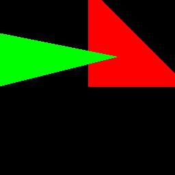

# 计算机图形学第一次作业说明文档
#####
## 目标实现
### 函数(1)
 `LookAt(eye, center, up)`函数主要目的是实现视图矩阵，具体来说是将宇宙空间中观察者与被观察物体的位置关系与观测方向转移至坐标轴上，并使相机摆放在原点，**观测方向定在z轴的负向，相机向上的方向与y轴正向相同**。具体实现时，我们考虑逆过程，将按上述摆好的坐标移动至真实位置，可以先旋转后平移，然后求逆即可。不难得到视图矩阵：
$$
M_{View} =
\left[
\begin{matrix}
    r_x & r_y & r_z & -\mathbf{right} \cdot \mathbf{eye}\\
    u_x & u_y & u_z & -\mathbf{up} \cdot \mathbf{eye}\\
    -f_x & -f_y&-f_z & -\mathbf{forward} \cdot \mathbf{eye}\\
    0&0&0&1
\end{matrix}
\right]
$$
*其中值得注意的是，为了保证右手系运算，观测方向被定在z轴的负向，也就导致forward前负号的产生。*
*此外代码中up的方向实际被更新为new_up,是因为考虑到有可能给出的up与forward方向不垂直，这样做保证了得到的是直角系*

该部分代码如下：
```python
def LookAt(eye, center, up): #构建视图矩阵，
    forward = center - eye
    forward /= np.linalg.norm(forward)

    right = np.cross(forward, up)
    right /= np.linalg.norm(right)

    new_up = np.cross(forward, right)#防止给出的up与forward方向不垂直，保证为直角系

    # 构建视图矩阵
    view_matrix = np.eye(4)
    view_matrix[0, :3] = right
    view_matrix[1, :3] = new_up
    view_matrix[2, :3] = -forward
    view_matrix[:3, 3] = -np.dot([right, new_up, -forward], eye)#将eye的世界坐标通过点积计算得到在相机坐标系的位置，并放在第四列
    return view_matrix
```
### 函数(2) (3) 
由于透视矩阵的实现过程可以分为两步，第一步将视锥体压缩，使其符合人类观测直觉，第二步是正交投影，使其映射到三边为[-1,1]的立方体中，因此我们将其分为两步，首先实现了正交投影，正交投影很简单，一样可以分为平移和放缩两步。

第一步平移矩阵为：

$$
\left[
    \begin{matrix}
        1&0&0&-\frac{left+right}{2}\\
        0&1&0&-\frac{bottom+top}{2}\\
        0&0&1&-\frac{near+far}{2}\\
        0&0&0&1\\
    \end{matrix}
\right]
$$

第二步缩放矩阵为：

$$
\left[
    \begin{matrix}
        \frac{2}{right-left}&0&0&0\\
        0&\frac{2}{top-bottom}&0&0\\
        0&0&\frac{2}{far-near}&0\\
        0&0&0&1
    \end{matrix}
\right]
$$
两者相乘得到正交矩阵：
$$
M_{Ortho} = 
\left[
    \begin{matrix}
        \frac{2}{right-left}&0&0&-\frac{right + left}{right - left}\\
        0&\frac{2}{top-bottom}&0&-\frac{top + bottom}{top - bottom}\\
        0&0&-\frac{2}{far-near}&\frac{far + near}{far - near}\\
        0&0&0&1
    \end{matrix}
\right]
$$
*同样我们注意到第三行与上两行相比多了一个负号，还是因为右手系的缘故，far本来应该比near大，因为负向的缘故，导致实际far比near小。*
```python
def Ortho(left, right, bottom, top, near, far): #正交投影
    Ortho_matrix = np.array([
    [2 / (right - left), 0, 0, -(right + left) / (right - left)],
    [0, 2 / (top - bottom), 0, -(top + bottom) / (top - bottom)],
    [0, 0, -2 / (far - near), (far + near) / (far - near)],#由于z轴方向与forward方向相反
    [0, 0, 0, 1]
])
    return Ortho_matrix
```

透视投影压缩的方法比较复杂，大致方法是x与y方向的仍按照比例放缩，z方向规律通过列方程求解，参考搜集的资料，我们可以首先写出矩阵$M_{Persp\to Ortho}$：

$$
M_{Persp\to Ortho} = 
\left[
    \begin{matrix}
        near&0&0&0\\
        0&near&0&0\\
        0&0&near+far&-near*far\\
        0&0&1&0
    \end{matrix}
\right]
$$
则由变换的性质，$M_{Ortho}$ $M_{Persp\to Ortho}$就是我们想得到的透视投影最终结果。
```python
def Perspective(fov, aspect=1.0, near=0.1, far=10.0): #透视投影
    near , far = far , near# 这里near比far小，为了保持右手系一贯性交换near、far
    mat = np.array([
        [near, 0, 0, 0],
        [0, near, 0, 0],
        [0, 0, (far + near), -(far * near)],   
        [0, 0, 1, 0]
    ]) 
    H = 2 * np.tan(np.radians(fov)/2) * np.abs(near)
    W = H * aspect
    top = H/2
    bottom = -H/2
    left = -W/2
    right = W/2
    Ortho_matrix = Ortho(left, right, bottom, top, near, far)

    Perspective_matrix = Ortho_matrix @ mat
    return Perspective_matrix
```
*可见在具体实现中，我们通过`Perspective`函数给出的fov与aspect得到要传递给`Ortho`函数的变量值，最终通过矩阵乘法实现了透视投影。*
### 函数(4) 
'inside'函数的实现比较简单，只需保证该点在三角形三边的同一侧即可。具体实现通过向量叉积判断左右关系。那么首先可以求出三边方程，注意此时三边要按照顺或逆时针选取，不可随意为之。然后设该点为P，计算与顶点连线的向量，然后依次计算叉积。之后我们利用三个叉积结果两两点积，就可以判断是否在同一侧了。

代码如下：
```python
def inside(self, x, y, z): #判断点(x,y,z)是否在三角形里
    A = self.vertices[0]
    B = self.vertices[1]
    C = self.vertices[2]

    # 计算点到三个顶点的向量
    PA = A - np.array([x, y, z])
    PB = B - np.array([x, y, z])
    PC = C - np.array([x, y, z])

    # 计算三角形的三个边的法线向量
    AB = B - A
    BC = C - B
    CA = A - C

    # 计算点到三个顶点的法线向量
    normal1 = np.cross(AB, PA)
    normal2 = np.cross(BC, PB)
    normal3 = np.cross(CA, PC)

    # 检查点是否在三角形内
    if (np.dot(normal1, normal2) > 0) and (np.dot(normal2, normal3) > 0):
        return True
    else:
        return False
```
### 函数(5) 
要实现`rotate_norm`函数，我们可以分为三个步骤，首先将旋转点移至远点，然后从过原点的轴旋转我们可以类比二维的实现方法得到旋转矩阵，然后再把旋转点从原点移至原来的位置，整个变换就算完成。

其中第二部的旋转变换公式为：
$$
\vec{r'} = \vec{r}\cos\alpha +\vec{n}(\vec{n}\cdot\vec{r})(1-\cos\alpha)+(\vec{n}\times\vec{r})\sin\alpha
$$

进而有旋转矩阵：

$$
R(\vec{n}, \theta)=
\left[\begin{matrix}
   n_x^2 +\cos\theta(1-n_x^2)&n_xn_y(1-\cos\theta)-n_z\sin\theta&n_xn_z(1-\cos\theta)+n_y\sin\theta\\
   n_xn_y(1-\cos\theta)+n_z\sin\theta&n_y^2+\cos\theta(1-n_y^2)&n_yn_z(1-\cos\theta)-n_x\sin\theta\\
   n_xn_z(1-\cos\theta)-n_y\sin\theta&n_yn_z(1-\cos\theta)+n_x\sin\theta&n_z^2+\cos\theta(1-n_z^2)
\end{matrix}\right]
$$
按照如上步骤可以写出代码：
```python
def rotate_norm(self, thea):
    
    A = self.vertices[0]
    B = self.vertices[1]
    C = self.vertices[2]

    edge1 = B - A
    edge2 = C - A
    normal = np.cross(edge1, edge2)#求出法线方程

    center = (A + B + C) / 3.0#旋转点

    cos_thea = np.cos(thea)
    sin_thea = -np.sin(thea)#逆时针
    rotation_matrix = np.array([
        [cos_thea + (1 - cos_thea) * normal[0]**2, (1 - cos_thea) * normal[0] * normal[1] - sin_thea * normal[2], (1 - cos_thea) * normal[0] * normal[2] + sin_thea * normal[1]],
        [(1 - cos_thea) * normal[0] * normal[1] + sin_thea * normal[2], cos_thea + (1 - cos_thea) * normal[1]**2, (1 - cos_thea) * normal[1] * normal[2] - sin_thea * normal[0]],
        [(1 - cos_thea) * normal[0] * normal[2] - sin_thea * normal[1], (1 - cos_thea) * normal[1] * normal[2] + sin_thea * normal[0], cos_thea + (1 - cos_thea) * normal[2]**2]
    ])# 创建旋转矩阵
    self.vertices = (rotation_matrix @ (self.vertices - center).T).T + center
 ```
 *或者可以有一种有趣的理解方式，我们既可以把`vertices-center`看作点的平移，也可以直接理解成向量，向量是没有位置的，因此可以不考虑旋转点位置的影响。*
*****
 ### 结果(a)(b) 
 我没有修改原始的观测参数，也没有修改三角形t的参数，数据如下：
 ```python
 R = Rasterization(256, 256)
R.setViewM(LookAt(np.array([0.0, 0.0, 3.0]), np.array([0.0, 0.0, 0.0]), np.array([0.0, 1.0, 0.0])))
R.setProjM(Perspective(60))

t = Triangle()
t.setVertex(0, 0, 1.0, 0.0)
t.setVertex(1, -1.0, 0.0, 1.0)
t.setVertex(2, 1.0, 0.0, 1.0)

t.setColor(0, 1.0, 0.0, 0.0)
t.setColor(1, 0.0, 1.0, 0.0)
t.setColor(2, 0.0, 0.0, 1.0)
 ```
然后经过透视投影，正交投影，再经过颜色插值（后面再说），得到的渲染结果如下：

<center>
    
    <br>
    <div style="color:orange; border-bottom: 1px solid #d9d9d9;
    display: inline-block;
    color: #999;
    padding: 2px;">(a)(b)题结果</div>
</center>

 ### 结果(c)
 这里只需对上面t的结果进行一个固定角度的旋转，就可以得到我们想要的。保持t的参数不变，在`render`函数之前，调用`rotate_norm`，输入想要的旋转角度进行旋转即可。
 ```python
t.rotate_norm(np.pi*3/4)
R.render([T])
 ```
 <center>
    
    <br>
    <div style="color:orange; border-bottom: 1px solid #d9d9d9;
    display: inline-block;
    color: #999;
    padding: 2px;">(c)题旋转45度结果</div>
</center>
 <center>
    
    <br>
    <div style="color:orange; border-bottom: 1px solid #d9d9d9;
    display: inline-block;
    color: #999;
    padding: 2px;">(c)题旋转90度结果</div>
</center>
 <center>
    
    <br>
    <div style="color:orange; border-bottom: 1px solid #d9d9d9;
    display: inline-block;
    color: #999;
    padding: 2px;">(c)题旋转135度结果</div>
</center>
 <center>
    
    <br>
    <div style="color:orange; border-bottom: 1px solid #d9d9d9;
    display: inline-block;
    color: #999;
    padding: 2px;">(c)题旋转180度结果</div>
</center>

### 结果(d)

上面展示的图片已经拥有了颜色插值的信息。要求采用基于重心坐标的插值方法，即计算$\Delta ABC$内一点$P$的重心坐标$\alpha, \beta, \gamma$，对于该点的颜色$f_P$，有如下计算公式：

$$
f_p = \alpha f_A + \beta f_b + \gamma f_C\\
\begin{align*}
\alpha&= \frac{S_{\Delta PBC}}{S_{\Delta ABC}}\\
\beta&= \frac{S_{\Delta PAC}}{S_{\Delta ABC}}\\
\gamma&=\frac{S_{\Delta PAB}}{S_{\Delta ABC}}
\end{align*}
$$
```python
def barycentric_coordinates(self, x, y, z):
    A = self.vertices[0]
    B = self.vertices[1]
    C = self.vertices[2]

    detT = (B[1] - C[1]) * (A[0] - C[0]) + (C[0] - B[0]) * (A[1] - C[1])
    alpha = ((B[1] - C[1]) * (x - C[0]) + (C[0] - B[0]) * (y - C[1])) / detT
    beta = ((C[1] - A[1]) * (x - C[0]) + (A[0] - C[0]) * (y - C[1])) / detT
    gamma = 1 - alpha - beta
    return (alpha, beta, gamma)
```
*此处仅展示了求$P$点重心坐标的方法,因为具体插值时考虑深度测试，因此代码将在下面给出。*

### 结果(e)
渲染单个像素时，记录该像素对应物体深度，颜色只取深度最浅者。而该像素对应位置这可以通过重心坐标进行插值计算。
```python
def rasterize_triangle(self, t): #光栅化一个三角形

    H, W, _ = self.color_buf.shape

    v4 = t.to_homogeneous_coordinates()#将三角形化为齐次坐标
    v4 = (self.proj_m @ self.view_m @ v4.T).T#求出透视正交变换之后图形
    v4 = v4 / np.repeat(v4[:,3:], 4, axis=1)#第四维标准化

    v4 = v4 * 0.5 + 0.5 #将其规范在[0,1]范围

    raster_t = Triangle()
    raster_t.setVertex(0, v4[0][0]*W, v4[0][1]*H, 0)
    raster_t.setVertex(1, v4[1][0]*W, v4[1][1]*H, 0)
    raster_t.setVertex(2, v4[2][0]*W, v4[2][1]*H, 0) #丢去深度信息将其投影在屏幕上
    
    for x in range(W):
        for y in range(H):
            if raster_t.inside(x, H-1-y, 0):
                barycentric = raster_t.barycentric_coordinates(x, H - 1 - y, 0)                   
                current_depth = (barycentric[0] * v4[0][2] + barycentric[1] *v4[1][2] + barycentric[2] * v4[2][2]) #计算深度信息
                if current_depth > self.depth_buf[y][x]:
                    # 如果当前深度小于深度缓冲区中的值，更新深度缓冲区
                    color = (barycentric[0] * t.colors[0] + barycentric[1] * t.colors[1] + barycentric[2] * t.colors[2]) #计算颜色插值
                    self.depth_buf[y][x] = current_depth
                    self.color_buf[y][x] = color
```
具体渲染过程中，我们首先算出重心坐标，和颜色插值类似，我们也可以利用v4算出该像素点的深度信息，存在`currunt_depth`中，接着我们与缓存区比较，更浅就更新缓存并染色。(注意此处还是右手系的缘故，我们认为越浅反而数字大。在具体染色时，使用的是rasert_t,这是已经投影在屏幕上丢掉深度信息的数据)

我根据提供的两个三角形数据进行输入，得到深度测试的结果如下：
 <center>
    
    <br>
    <div style="color:orange; border-bottom: 1px solid #d9d9d9;
    display: inline-block;
    color: #999;
    padding: 2px;">(e)题结果</div>
</center>

### 结果(f)

此处旋转与之前不同，采用了绕三轴旋转，那我在Triangle类里又实现了`rotate_zyx`函数。根据题意，是最终绕z轴转了60度，绕y轴转了90度，绕x轴转了60度，同时颜色从红变绿。那不妨设定一个完成率，我记作`time`，在采用旋转角与颜色时，按倍率变化即可。

旋转矩阵：
$$
R_z=
\left[\begin{matrix}
   \cos\theta_z&-\sin\theta_z&0\\
   \sin\theta_z&\cos\theta_z&0\\
   0&0&1
\end{matrix}\right]
$$

$$
R_y=
\left[\begin{matrix}
   \cos\theta_y&0&\sin\theta_y\\
   0&1&0\\
   -\sin\theta_y&0&\cos\theta_y
\end{matrix}\right]
$$

$$
R_x=
\left[\begin{matrix}
   1&0&0\\
   0&\cos\theta_x&-\sin\theta_x\\
   0&\sin\theta_x&\cos\theta_x  
\end{matrix}\right]
$$

颜色变化矩阵：
$$
R_c=
\left[\begin{matrix}
   1-time&time&0\\
   1-time&time&0\\
   1-time&time&0   
\end{matrix}\right]
$$

代码实现：
```python
def rotate_zyx(self, angle_z, angle_y, angle_x,time):

    angle_z = np.radians(angle_z)*time  #根据time设定旋转角
    # 创建绕Z轴的旋转矩阵
    rotation_matrix_z = np.array([
        [np.cos(angle_z), -np.sin(angle_z), 0],
        [np.sin(angle_z), np.cos(angle_z), 0],
        [0, 0, 1]
    ])
    self.vertices = (rotation_matrix_z @ self.vertices.T).T#绕z轴旋转

    angle_y = np.radians(angle_y)*time  
    # 创建绕Y轴的旋转矩阵
    rotation_matrix_y = np.array([
        [np.cos(angle_y), 0, np.sin(angle_y)],
        [0, 1, 0],
        [-np.sin(angle_y), 0, np.cos(angle_y)]
    ])
    self.vertices = (rotation_matrix_y @ self.vertices.T).T

    angle_x = np.radians(angle_x)*time  
    # 创建绕X轴的旋转矩阵
    rotation_matrix_x = np.array([
        [1, 0, 0],
        [0, np.cos(angle_x), -np.sin(angle_x)],
        [0, np.sin(angle_x), np.cos(angle_x)]
    ])
    self.vertices = (rotation_matrix_x @ self.vertices.T).T

    #根据时间设定颜色
    self.setColor(0, 1-time, time, 0)
    self.setColor(1, 1-time, time, 0)
    self.setColor(2, 1-time, time, 0)
```
按要求旋转结果如下：
 <center>
    
    <br>
    <div style="color:orange; border-bottom: 1px solid #d9d9d9;
    display: inline-block;
    color: #999;
    padding: 2px;">(e)题t=0结果</div>
</center>
 <center>
    
    <br>
    <div style="color:orange; border-bottom: 1px solid #d9d9d9;
    display: inline-block;
    color: #999;
    padding: 2px;">(e)题t=0.25结果</div>
</center>
 <center>
    
    <br>
    <div style="color:orange; border-bottom: 1px solid #d9d9d9;
    display: inline-block;
    color: #999;
    padding: 2px;">(e)题t=0.5结果</div>
</center>
 <center>
    
    <br>
    <div style="color:orange; border-bottom: 1px solid #d9d9d9;
    display: inline-block;
    color: #999;
    padding: 2px;">(e)题t=0.75结果</div>
</center>
 <center>
    
    <br>
    <div style="color:orange; border-bottom: 1px solid #d9d9d9;
    display: inline-block;
    color: #999;
    padding: 2px;">(e)题t=1结果</div>
</center>

*推测`t=1`时刻图像为全黑，是因为该三角形所在平面已经平行于视线方向*。