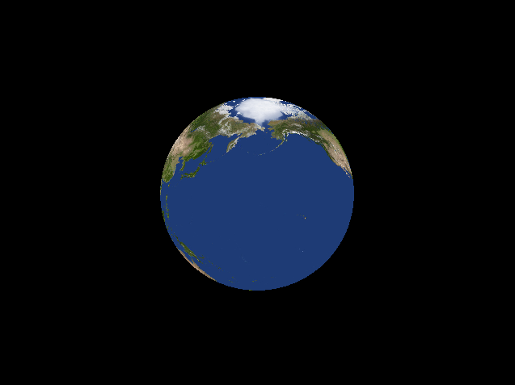
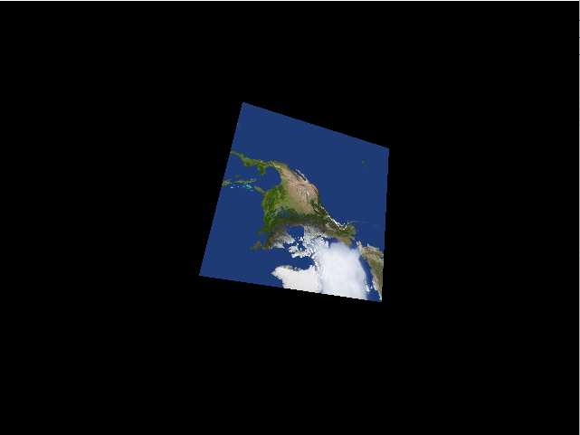
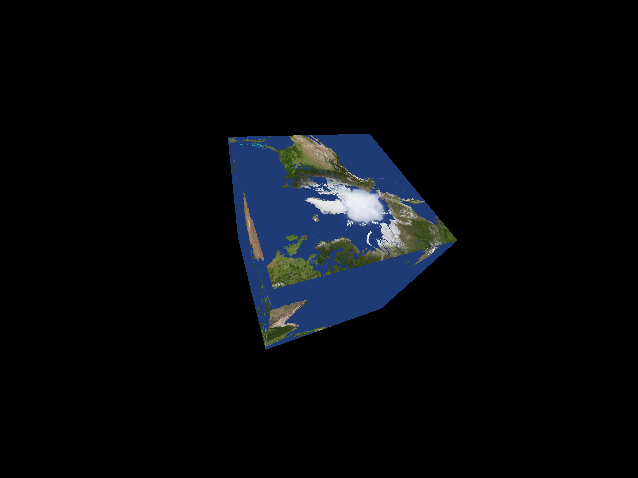
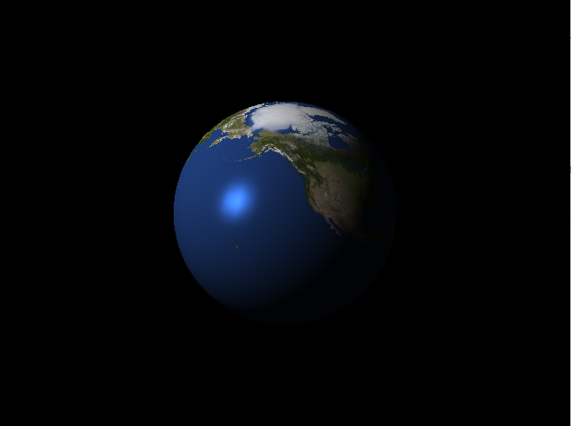
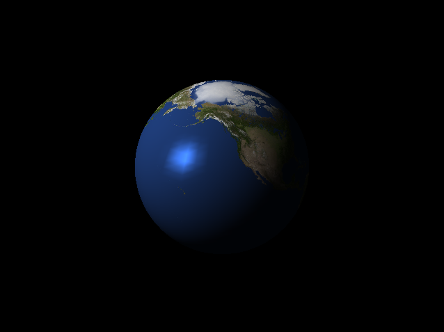
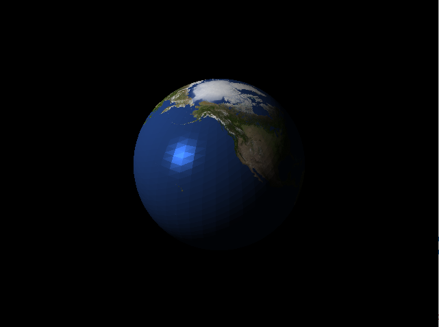
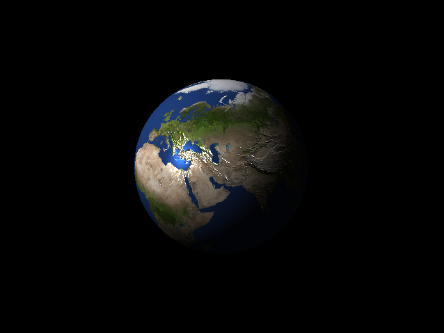
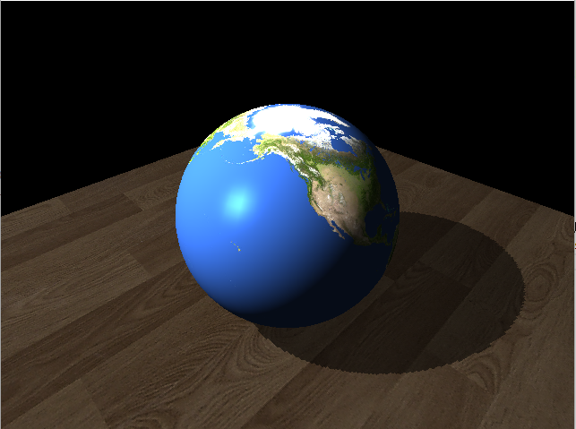

# 作业2实验报告
*****
#### 1. 将球面进行三角化（用多个三角形表示球面），并将图片 earthmap.jpg 作为纹理图贴到球面上进行绘制。（6 分）ps：邻近的经纬线会交叉形成多个 4 边形，将四边形其中一对角点连接，形成 2 个三角形。
* 首先根据题意，需要将地球纹理贴到一个球上，而且不需要计算光照，因此我们可以根据给出的 texture.py 来进行修改。原代码呈现结果为将地图贴在一个三棱锥上，我们重构几何结构：
```python

def generate_sphere(radius, num_segments):
    vertices = []
    normals = []
    texcoords = []

    for i in range(num_segments + 1):
        for j in range(num_segments + 1):
            theta = i * np.pi / num_segments
            phi = j * 2 * np.pi / num_segments

            x = radius * np.sin(theta) * np.cos(phi)
            y = radius * np.sin(theta) * np.sin(phi)
            z = radius * np.cos(theta)

            vertices.append([x, y, z, 1.0])

            norm = np.array([x, y, z])
            norm = norm / np.linalg.norm(norm)
            normals.append(norm)

            s = j / num_segments
            t = i / num_segments
            texcoords.append([s, t])

    indices = []
    for i in range(num_segments):
        for j in range(num_segments):
            v0 = i * (num_segments + 1) + j
            v1 = v0 + 1
            v2 = (i + 1) * (num_segments + 1) + j
            v3 = v2 + 1

            indices.extend([v0, v1, v2, v1, v3, v2])

    return np.array(vertices, np.float32), np.array(texcoords, np.float32), np.array(normals, np.float32), np.array(indices, np.uint32)

```
我们根据自己设定的球半径及经纬线取样条数，按照经纬线分割方式，可以确定取样的每个顶点坐标，然后拓展成4维向量，存入`vertices`，然后由于是球面，显然知道每个顶点的法向量方向就是(x, y, z),需要注意的是，由于半径不一定，因此需要将法向量归一化，就可以轻松得到`norms`。又由于分割的经纬网格线已知，因此可以一一行列对应得到纹理坐标`texcoords`，又由于我们使用opengl需要绘制三角形，而经纬线分割出来只是近似的四边形，我们需要将四边形沿对角线切开，，四个点变6个点，由于OpenGL提供了glDrawElements的好方法，我们不需要将顶点数据全存一遍，只需要给出相应的顶点索引`indices`即可。
* 接着我们修改`initialize()`函数，在这里我们链接并编译着色器，然后将生成球的数据绑定，注意索引要绑定到`GL_ELEMENT_ARRAY_BUFFER`然后绑定我们的图片到`GL_TEXTURE0`。由于VAO的使用，在之后使用时绑定VAO就可以了。
* 在`render`函数里，我们需要在完成一些常规操作之外，为`shader`里`uniform`变量赋值，传入纹理数据，然后就可以画出结果了。
* 此外，我修改了`calc_mvp`转轴向量与`lookAt`中观察的方向，以使得地球按照合乎常理的方式旋转。
* 至此第一题贴图就完成了：
 <center>
    
    <br>
    <div style="color:orange; border-bottom: 1px solid #d9d9d9;
    display: inline-block;
    color: #999;
    padding: 2px;">第一题结果</div>
</center>

#### 2. 将图片 earthmap.jpg 当做环境贴图，贴在一个立方体上。（4 分）
* 这一题的关键是采样方法的改变，我们需要构建一个立方体，然后放在球内或球外，按照顶点的方向找出球上对应点，然后按照我们构建球的纹理坐标进行采样，但贴出来的图在正方形上显得很奇怪，而且这样的采样方式会导致边缘畸变和锯齿，十分不美观，因此我想换成一种更有趣的方式实现：天空盒。
* 由于上述原因，如果这样采样得到的天空盒贴图十分不真实，因此在GitHub搜索发现已经有人实现了从sphere map到cube map转换的方法(https://jaxry.github.io/panorama-to-cubemap/)，效果非常好，这能极大的提高我们天空盒的质量，于是我们将6个面的贴图存下来，按照learnOpenGL教程给出的天空盒制作方法，具体贴图方法和第一题大差不差，注意在绑定纹理和使用时用`GL_TEXTURE_CUBE_MAP`，就可以简单的贴好了。然后为了看到结果，我们想使用一个镜子盒子，看到天空盒的效果，这就像需要我们修改着色器程序：
```GLSL
VERTEX_SHADER = """
#version 430

    layout(location = 0) in vec4 position;
    layout(location = 1) in vec4 normal;
    uniform mat4 Model;
    uniform mat4 View;
    uniform mat4 Projection;

    out vec3 Normal;
    out vec3 Position;
    void main() {
        gl_Position = Projection * View * Model * position;
        Normal = mat3(transpose(inverse(Model))) * normal.xyz;
        Position = vec3(Model * position);
    }
"""

FRAGMENT_SHADER = """
#version 430

    in vec3 Normal;
    in vec3 Position;
    uniform vec3 cameraPos;
    uniform samplerCube skybox;
    out vec4 outputcolor;
    void main() {
        vec3 I = normalize(cameraPos - Position);
        vec3 R = reflect(I, normalize(Normal));
        outputcolor = texture(skybox, R);
    }
"""
```
在`FRAGMENT_SHADER`中，我们计算了视线方向I，然后通过反射函数算出来入射方向，然后根据这个方向采样天空盒，就可以得到镜面的效果。
* 实现的时候，在天空盒渲染时要禁用深度写入。这样子天空盒就会永远被绘制在其它物体的背后。
```
glDepthMask(GL_FALSE);
```
在绘制地球时要重新开启：
```
glDepthMask(GL_TRUE);
```
* 我们还希望移除视图矩阵中位移的部分，这样就可以在观察者移动时，天空盒位置向量不会发生变化。由于我呈现方式观察者不会变化，所以简单的model矩阵跟随观察者平移就可以解决问题，更佳的方法可以参考learnOpenGL。
* 由于动态的效果不便展示，我截取了两张，最终得到天空盒效果如下：
 <center>
    
    <br>
    <div style="color:orange; border-bottom: 1px solid #d9d9d9;
    display: inline-block;
    color: #999;
    padding: 2px;">第二题结果1</div>
</center>
 <center>
    
    <br>
    <div style="color:orange; border-bottom: 1px solid #d9d9d9;
    display: inline-block;
    color: #999;
    padding: 2px;">第二题结果2</div>
</center>
可以看到，随着镜子盒子的转动，看到了天空盒的不同角度。

#### 3. 实现光照计算（Blinn-Phong）模型。几何可以用 1 中构造的球，方便计算法向量。实现三种不同采样频率（三角形、顶点、像素）。（6 分）
##### 3.3逐像素采样
* 逐像素采样一般是主要的实现方式，通过设置光源，修改着色器加入光照，就可以在第一题基础上得到带光照模型的地球。
```GLSL
VERTEX_SHADER = """
#version 430
 
layout(location = 0) in vec4 position;
layout(location = 1) in vec2 texcoord;
layout(location = 2) in vec3 norm;
uniform mat4 MVP;

out vec2 vt_texcoord;
out vec4 Position;
out vec3 Norm;

void main() {
    gl_Position = MVP * position;
    Position = position;
    Norm = norm;
    vt_texcoord = texcoord;

}
"""

FRAGMENT_SHADER = """
#version 430
uniform sampler2D tex0;

uniform mat4 M; // 法线变换矩阵
uniform vec3 lightPos;    // 光源在世界坐标下的位置
uniform vec3 lightColor;  // 光源的颜色
uniform vec3 viewPos;     // 视角在世界坐标下的位置

in vec2 vt_texcoord;
in vec4 Position;
in vec3 Norm;

out vec4 outputColor;

void main() {
    //环境光照
    float ambientStrength = 0.05;
    vec3 ambient = ambientStrength * lightColor;

    // 漫反射
    float diffuseStrength = 1;
    vec3 norm = mat3(transpose(inverse(M))) * Norm;
    vec3 dd = lightPos - (M * Position).xyz;
    vec3 lightDir = normalize(dd);
    vec3 diffuse = lightColor * max(dot(norm, lightDir), 0.0) * diffuseStrength;

    // 镜面反射
    float specularStrength = 2;
    vec3 viewDir = normalize(viewPos - (M * Position).xyz); 
    vec3 reflectDir = reflect(-lightDir, norm); 
    float spec = pow(max(dot(viewDir, reflectDir), 0.0), 32); 
    vec3 specular = lightColor * spec * specularStrength;

    vec4 fliter = vec4(ambient + diffuse + specular, 1);
    vec4 kd = texture(tex0, vt_texcoord);

    outputColor = kd * fliter;

}
"""
```
可以看到，我们的修改主要在片段着色器中，接收顶点的位置信息，片段着色器会把我们需要的像素的位置信息进行插值，然后我们的光照计算就是针对像素的了。首先，我们需要传入灯的位置、颜色、以及观察位置的信息。然后我们可以设置环境光强度，直接乘灯的颜色信息就可以得到环境光的值，同理我们设置比环境光强度高不少的漫反射强度，它占据我们看到的主要效果。首先看到我们需要将法向量投射到世界坐标系，然后计算得到的正则化的光入射信息，然后通过入射光方向和法向量点乘决定反射的多少，最后三者相乘得到漫反射的值。镜面反射同理，只不过他需要考虑反射光的方向，通过光入射方向预测的光反射方向与观测方向的点乘，可以知道这里应该不应该有高光，是多少。然后通过高次幂，进行“锐化”，保证只有很少的一个区域才会出现高光。把`ambient + diffuse + specular`的结果作为最终光照模型的结果，然后乘上纹理的颜色，得到反射看到的颜色结果。
* 可以看到最终呈现的结果非常自然，因为在每个像素都进行了光照计算。
</center>
 <center>
    
    <br>
    <div style="color:orange; border-bottom: 1px solid #d9d9d9;
    display: inline-block;
    color: #999;
    padding: 2px;">第三题结果（逐像素）</div>
</center>

##### 3.2逐顶点采样
* 光照模型与3.1相同，此处不再赘述。主要变化为：光照计算的位置由片段着色器转移至顶点着色器，也就是先计算顶点光照的结果，然后在片段着色器进行插值。
```GLSL
VERTEX_SHADER = """
#version 430
 
layout(location = 0) in vec4 position;
layout(location = 1) in vec2 texcoord;
layout(location = 2) in vec3 norm;
uniform mat4 MVP;
uniform mat4 M; // 法线变换矩阵

uniform vec3 lightPos;    // 光源在世界坐标下的位置
uniform vec3 lightColor;  // 光源的颜色
uniform vec3 viewPos;     // 视角在世界坐标下的位置

out vec2 vt_texcoord;
out vec4 fliter;

void main() {
    gl_Position = MVP * position;

    // 环境光
    float ambientStrength = 0.05;
    vec3 ambient = ambientStrength * lightColor;

    // 漫反射
    float diffuseStrength = 1;
    vec3 norm = mat3(transpose(inverse(M))) * norm;
    vec3 dd = lightPos - (M * position).xyz;
    vec3 lightDir = normalize(dd);
    vec3 diffuse = lightColor * max(dot(norm, lightDir), 0.0) * diffuseStrength;

    // 镜面反射
    float specularStrength = 2;
    vec3 viewDir = normalize(viewPos - (M * position).xyz); 
    vec3 reflectDir = reflect(-lightDir, norm); 
    float spec = pow(max(dot(viewDir, reflectDir), 0.0), 32); 
    vec3 specular = lightColor * spec * specularStrength;

    fliter = vec4(ambient + diffuse + specular, 1);
    vt_texcoord = texcoord;

}
"""

FRAGMENT_SHADER = """
#version 430
uniform sampler2D tex0;

in vec4 fliter;
in vec2 vt_texcoord;

out vec4 outputColor;

void main() {
    vec4 kd = texture(tex0, vt_texcoord);
    outputColor = kd * fliter;

}
"""
```
</center>
 <center>
    
    <br>
    <div style="color:orange; border-bottom: 1px solid #d9d9d9;
    display: inline-block;
    color: #999;
    padding: 2px;">第三题结果（逐顶点）</div>
</center>
可以看出，尤其是高光部分，三角形的轮廓会比较明显，据我分析，只在顶点计算的结果在高光这种剧烈变化的小区域进行插值，变化的速度不够快，效果肯定比不上逐像素的计算结果，会出现比较明显的边缘。

##### 3.1逐三角形采样
* 逐三角形采样，最主要的变化在于法向量，之前的叙述中，我们一直按照正则化的（x, y, z）来当作法向量。逐三角形采样，一个三角形应该使用一个法向量，但对于一个顶点，在不同的三角形会使用不同的法向量，这就产生了问题，我们按照`indices`进行选点选法向量时，一个点显然对应一个法向量。因此，我采用了一个笨办法，不使用索引找点，我们多花费空间把点依次的传进去，这样可以传多次同一个点，但对应不同的法向量，就解决了这个问题。
```python
def generate_sphere(radius, num_segments):
    vertices0 = []
    normals0 = []
    texcoords0 = []

    for i in range(num_segments + 1):
        for j in range(num_segments + 1):
            theta = i * np.pi / num_segments
            phi = j * 2 * np.pi / num_segments

            x = radius * np.sin(theta) * np.cos(phi)
            y = radius * np.sin(theta) * np.sin(phi)
            z = radius * np.cos(theta)

            vertices0.append([x, y, z, 1.0])

            norm = np.array([x, y, z])
            norm = norm / np.linalg.norm(norm)
            normals0.append(norm)

            s = j / num_segments
            t = i / num_segments
            texcoords0.append([s, t])

    indices = []
    for i in range(num_segments):
        for j in range(num_segments):
            v0 = i * (num_segments + 1) + j
            v1 = v0 + 1
            v2 = (i + 1) * (num_segments + 1) + j
            v3 = v2 + 1

            indices.extend([v0, v1, v2, v1, v3, v2])

    vertices = []
    normals = []
    texcoords = []

    for i in range(0, len(indices), 3):
        x, y, z = i, i + 1, i + 2
        vertices.append(vertices0[indices[x]])
        vertices.append(vertices0[indices[y]])
        vertices.append(vertices0[indices[z]])
        norm = (normals0[indices[x]]+normals0[indices[y]]+normals0[indices[z]])/3
        normals.append(norm)
        normals.append(norm)
        normals.append(norm)
        texcoords.append(texcoords0[indices[x]])
        texcoords.append(texcoords0[indices[y]])
        texcoords.append(texcoords0[indices[z]])
    return np.array(vertices, np.float32), np.array(texcoords, np.float32), np.array(normals, np.float32),np.array(indices, np.uint32)


```
可以看到前面与之前的方法无异，然后按索引取点传入新的`vertices`,并计算三角形整体插值的法向量传入。最后画图时，只需用`glDrawArrays`即可。着色器我采用了3.3的方法。
</center>
 <center>
    
    <br>
    <div style="color:orange; border-bottom: 1px solid #d9d9d9;
    display: inline-block;
    color: #999;
    padding: 2px;">第三题结果（逐三角形）</div>
</center>
可见因为每个三角形的法向量相同，就会呈现出类似于高尔夫球的效果，三角形的拼接感会很明显。

#### 4. Bump Mapping 的实现，利用纹理实现 1 中球面的凹凸效果。（2 分）
* 根据查阅资料，Bump Mapping是一个灰度图，白色表示高，黑色表示低。那么我们需要修改法向量的方向，来实现光照显示凹凸效果。首先我们将bumpmap绑在`GL_TEXTURE1`，使用名为depth的采样器进行采样。
* 着色器可以在3.3的基础上进行修改。
```GLSL
VERTEX_SHADER = """
#version 430
 
layout(location = 0) in vec4 position;
layout(location = 1) in vec2 texcoord;
layout(location = 2) in vec3 norm;
uniform mat4 MVP;

out vec2 vt_texcoord;
out vec4 Position;
out vec3 Norm;

void main() {
    gl_Position = MVP * position;
    Position = position;
    Norm = norm;
    vt_texcoord = texcoord;

}
"""

FRAGMENT_SHADER = """
#version 430
uniform sampler2D tex0;
uniform sampler2D depth;

uniform mat4 M; // 法线变换矩阵
uniform vec3 lightPos;    // 光源在世界坐标下的位置
uniform vec3 lightColor;  // 光源的颜色
uniform vec3 viewPos;     // 视角在世界坐标下的位置

in vec2 vt_texcoord;
in vec4 Position;
in vec3 Norm;

out vec4 outputColor;

void main() {
    vec3 norm = mat3(transpose(inverse(M))) * Norm;

    vec2 left_Coord = vec2(vt_texcoord.x - 0.001, vt_texcoord.y);
    vec2 right_Coord = vec2(vt_texcoord.x + 0.001, vt_texcoord.y);
    vec2 up_Coord = vec2(vt_texcoord.x, vt_texcoord.y + 0.001);
    vec2 down_Coord = vec2(vt_texcoord.x, vt_texcoord.y - 0.001);

    vec3 U = normalize(vec3(norm.y, norm.x, 0.0));
    vec3 V = normalize(cross(norm, U));
    vec3 u_bias = (texture(depth,left_Coord).r - texture(depth,right_Coord).r)*U;
    vec3 v_bias = (texture(depth,down_Coord).r - texture(depth,up_Coord).r)*V;
    vec3 new_norm = norm + u_bias + v_bias;

    // 环境光
    float ambientStrength = 0.05;
    vec3 ambient = ambientStrength * lightColor;

    // 漫反射
    float diffuseStrength = 1;
    vec3 dd = lightPos - (M * Position).xyz;
    vec3 lightDir = normalize(dd);
    vec3 diffuse = lightColor * max(dot(new_norm, lightDir), 0.0) * diffuseStrength;

    // 镜面反射
    float specularStrength = 2;
    vec3 viewDir = normalize(viewPos - (M * Position).xyz); 
    vec3 reflectDir = reflect(-lightDir, new_norm); 
    float spec = pow(max(dot(viewDir, reflectDir), 0.0), 32); 
    vec3 specular = lightColor * spec * specularStrength;

    vec4 fliter = vec4(ambient + diffuse + specular, 1);
    vec4 kd = texture(tex0, vt_texcoord);

    outputColor = kd * fliter;

}
"""
```
可以看到，我取了bumpmap某个像素上下左右四个像素，然后可以分别计算在纹理图上u方向的高度变化和v方向高度的变化，但还需要算出贴图后u，v在世界坐标真实的方向，点乘之后相加就可以算出在真实坐标下法向量的偏移，在和法向量相加，就可以得出该点的法向量了。
* 贴图效果十分明显：
</center>
 <center>
    
    <br>
    <div style="color:orange; border-bottom: 1px solid #d9d9d9;
    display: inline-block;
    color: #999;
    padding: 2px;">第四题结果</div>
</center>
Ps：我高光设置的系数比较大，为了增强反光看出凹凸效果，略有失真，请谅解。

#### 5. 在球面的下方，放一个大的平面。然后实现阴影的效果。（2 分）
* 首先放置一个大的平面，需要给出平面的参数：
```python
def generate_floor():
    vertices = np.array([
        [-4.0, -4.0, -1.1],
        [4.0, -4.0, -1.1],
        [-4.0, 4.0, -1.1],
        [4.0, 4.0, -1.1],
    ], dtype=np.float32)

    texcoords = np.array([
        [0.0, 0.0],
        [1.0, 0.0],
        [0.0, 1.0],
        [1.0, 1.0],
    ], dtype=np.float32)

    normals = np.array([
        [0.0, 0.0, 0.1],
        [0.0, 0.0, 0.1],
        [0.0, 0.0, 0.1],
        [0.0, 0.0, 0.1],
    ], dtype=np.float32)

    indices = np.array([0, 1, 2, 2, 1, 3], dtype=np.uint32)

    return vertices, texcoords, normals, indices
```
然后绑定地板的纹理到`GL_TEXTURE2`，和贴地球纹理过程类似，不再赘述。
* 本题的关键是深度贴图的应用。
```python
def light_calc_mvp(width, height):
    proj = glm.perspective(glm.radians(60.0),float(width)/float(height),0.1,20.0)
    view = glm.lookAt(glm.vec3(4, -2, 5), glm.vec3(0,0,0),glm.vec3(0,1,0))
    model =  glm.mat4(1.0)
    mvp = proj * view * model
    return mvp
```
使用这个MVP矩阵，是为了将观测者转移到光源处，这样利用OpenGL的深度测试，就可以知道对光的遮挡关系，知道哪里应该使用阴影。
```GLSL
SHADOW_VERTEX_SHADER = """
#version 430

    layout(location = 0) in vec4 position;
    out vec4 Position;
    uniform mat4 MVP;
    void main()
    {
        gl_Position = MVP * position;
        Position = MVP * position;
    }
"""

SHADOW_FRAGMENT_SHADER = """
#version 430
    in vec4 Position;


    void main()
    {

    }
"""
```
阴影着色器很简单，只是为了过一遍着色器，利用depthMapFBO将深度存入depthMap。
```GLSL
VERTEX_SHADER = """
#version 430
 
layout(location = 0) in vec4 position;
layout(location = 1) in vec2 texcoord;
layout(location = 2) in vec3 norm;
uniform mat4 MVP;
uniform mat4 LMVP;

out vec2 vt_texcoord;
out vec4 Position;
out vec3 Norm;
out vec4 lightPosition;

void main() {
    gl_Position = MVP * position;
    Position = position;
    Norm = norm;
    vt_texcoord = texcoord;
    lightPosition = LMVP * position;

}
"""

FRAGMENT_SHADER = """
#version 430
uniform sampler2D tex0;
uniform sampler2D depth;

uniform mat4 M; // 法线变换矩阵
uniform vec3 lightPos;    // 光源在世界坐标下的位置
uniform vec3 lightColor;  // 光源的颜色
uniform vec3 viewPos;     // 视角在世界坐标下的位置


in vec2 vt_texcoord;
in vec4 Position;
in vec3 Norm;
in vec4 lightPosition;

out vec4 outputColor;

void main() {
    float ambientStrength = 0.2;
    vec3 ambient = ambientStrength * lightColor;

    // 漫反射
    float diffuseStrength = 3;
    vec3 norm = mat3(transpose(inverse(M))) * Norm;
    vec3 dd = lightPos - (M * Position).xyz;
    vec3 lightDir = normalize(dd);
    vec3 diffuse = lightColor * max(dot(norm, lightDir), 0.0) * diffuseStrength;

    // 镜面反射
    float specularStrength = 2;
    vec3 viewDir = normalize(viewPos - (M * Position).xyz); 
    vec3 reflectDir = reflect(-lightDir, norm); 
    float spec = pow(max(dot(viewDir, reflectDir), 0.0), 32); 
    vec3 specular = lightColor * spec * specularStrength;

    vec3 depthTexCoord = lightPosition.xyz / lightPosition.w;
    depthTexCoord = depthTexCoord * 0.5 + 0.5;
    float dep = texture(depth, depthTexCoord.xy).r;
    float shadow = depthTexCoord.z < dep +0.001 ? 1.0 : 0;

    vec4 fliter = vec4(ambient + diffuse *shadow + specular * shadow, 1);
    vec4 kd = texture(tex0, vt_texcoord);

    outputColor = kd * fliter;

}
"""
```
我是在3.3题的基础上进行修改，可以看出我多向片段着色器传入了在光源坐标系下的坐标lightPosition，光照计算正常进行，在最后多了一个加阴影的环节，根据在阴影贴图的采样结果，我将漫反射和高光都乘了一个阴影系数。这样得到的结果就会有阴影的产生。
</center>
 <center>
    
    <br>
    <div style="color:orange; border-bottom: 1px solid #d9d9d9;
    display: inline-block;
    color: #999;
    padding: 2px;">第五题结果</div>
</center>
Ps：使用原来的系数结果较暗，阴影不明显，所以我将反射系数都调大处理。