# 计算机图形学第三次作业报告
*****
## 1.1
### 1.1.1
`glMap1f(GL_MAP1_VERTEX_3, 0, 1, self.controlPoints) `将控制点映射到三维的顶点，用于贝塞尔曲线的绘制。`glEnable(GL_MAP1_VERTEX_3) `启用了将控制点映射到三维顶点的映射功能。
```python
glBegin(GL_LINE_STRIP)
for i in range(31):
    glEvalCoord1f(float(i) / 30)
glEnd()
```
`glBegin(GL_LINE_STRIP) `开始绘制线段，然后在一个循环中使用 `glEvalCoord1f `计算贝塞尔曲线上的点，然后由于`GL_LINE_STRIP`的设置，会在相邻的两个点之间绘制一条线段。并在最后通过 `glEnd() `结束了线段的绘制。
### 1.1.2
`glEvalCoord1f` 函数接收一个介于 0 到 1 之间的参数值，通常用来表示贝塞尔曲线上某个位置的参数化值。使用接收到的参数值，结合贝塞尔曲线的控制点进行计算。这个计算过程通常使用贝塞尔曲线的数学公式，如 de Casteljau 算法或其他曲线插值方法。计算过程可能包括对控制点进行线性或非线性插值，以便得到对应参数值的曲线上点的坐标。
## 1.2
```python
        glColor3f(1, 1, 1)
        glBegin(GL_LINE_STRIP)
        # Use De Casteljau's algorithm to compute points on the Bezier curve
        num_segments = 100  # Number of segments to approximate the curve
        for i in range(num_segments + 1):
            t = i / num_segments
            curve_point = self.compute_bezier_point(t)
            glVertex3fv(curve_point)

        glEnd()
        glFlush()
```
首先设定颜色为白色，仍然使用`glBegin(GL_LINE_STRIP) `开始绘制线段，这里我们使用num_segments确定曲线细分程度，依照上述猜测，我们使用de Casteljau 算法计算曲线上的点。算法在`compute_bezier_point`函数中给出。最后使用 `glVertex3fv `将这些计算得到的点添加到 `GL_LINE_STRIP `中。
```python
    def compute_bezier_point(self, t):
        """Compute a point on the Bezier curve at parameter t using De Casteljau's algorithm."""
        n = len(self.controlPoints) - 1
        temp_points = [point for point in self.controlPoints]  # Copy control points

        for k in range(1, n + 1):
            for i in range(n - k + 1):
                temp_points[i] = ((1 - t) * temp_points[i][0] + t * temp_points[i + 1][0],
                                    (1 - t) * temp_points[i][1] + t * temp_points[i + 1][1],
                                    (1 - t) * temp_points[i][2] + t * temp_points[i + 1][2])

        return temp_points[0]

        # 1.2
```
首先看i这个循环，邻近的两个点计算得到插值点的位置，每个i循环新的控制点数量都会-1。k循环更类似于一个迭代次数。利用k的循环，经过k循环的迭代，只剩下一个点，就是我们要找的贝塞尔曲线点的位置，十分巧妙。
<center>
    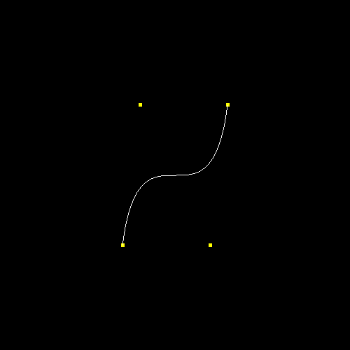
    <br>
    <div style="color:orange; border-bottom: 1px solid #d9d9d9;
    display: inline-block;
    color: #999;
    padding: 2px;">第1.2题结果</div>
</center>

## 1.3
由题意，我们只需绘出四个四分之一圆弧，就可以拼成一个圆。我在 bezier.py 里新建了一个`BezierCircle`类，传入四组控制点，每组绘制一个四分之一圆，其中控制点的数据是从网上搜索得到的（能画出圆弧）。调用四次`draw_bezier_curve`函数，函数过程和之前绘制一段贝塞尔曲线类似，不再赘述。值得注意的是，`glMap1f`每次都要绑定新的`controlPoints`。
```python
class BezierCircle(Window):
    """Use evaluators to draw a Bezier curve."""

    def __init__(self):
        """Constructor"""
        super(BezierCircle, self).__init__("bezcurve.c", "Bezier Curve", 500, 500, True)
        t = 4 / 3 * (np.sqrt(2) - 1) # magic number
        self.controlPoints1 = ((0, 1, 0), (t, 1, 0), (1, t, 0), (1, 0, 0))
        self.controlPoints2 = ((0, 1, 0), (-t, 1, 0), (-1, t, 0), (-1, 0, 0))
        self.controlPoints3 = ((0, -1, 0), (t, -1, 0), (1, -t, 0), (1, 0, 0))
        self.controlPoints4 = ((0, -1, 0), (-t, -1, 0), (-1, -t, 0), (-1, 0, 0))
        glClearColor(0, 0, 0, 0)
        glShadeModel(GL_FLAT)

    def display(self):
        """Display the control points as dots."""
        glClear(GL_COLOR_BUFFER_BIT)

        # 绘制四段曲线
        self.draw_bezier_curve(self.controlPoints1)
        self.draw_bezier_curve(self.controlPoints2)
        self.draw_bezier_curve(self.controlPoints3)
        self.draw_bezier_curve(self.controlPoints4)

    def draw_bezier_curve(self, controlPoints):
        """Draw a Bezier curve for given control points."""
        glMap1f(GL_MAP1_VERTEX_3, 0, 1, controlPoints)
        glEnable(GL_MAP1_VERTEX_3)
        glPointSize(5)
        glColor3f(1, 1, 0)
        glBegin(GL_POINTS)
        for point in controlPoints:
            glVertex3fv(point)
        glEnd()
        
        glColor3f(1, 1, 1)
        glBegin(GL_LINE_STRIP)
        for i in range(31):
            glEvalCoord1f(float(i) / 30)
        glEnd()
        glFlush()
```
<center>
    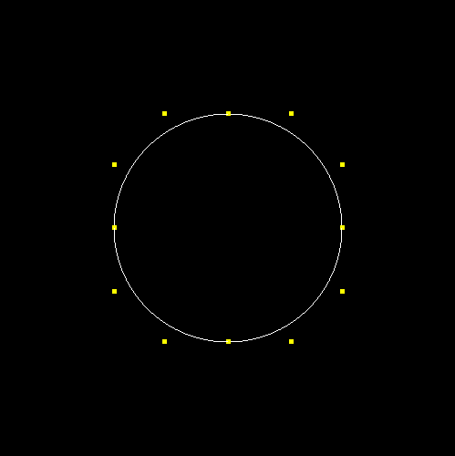
    <br>
    <div style="color:orange; border-bottom: 1px solid #d9d9d9;
    display: inline-block;
    color: #999;
    padding: 2px;">第1.3题结果</div>
</center>

## 抗锯齿
本人抗锯齿通过调用opengl接口实现。根据learnopenGL学习，给出的方法是使用多重采样。
```python
        glEnable(GL_MULTISAMPLE)
        glutSetOption(GLUT_MULTISAMPLE, 4)
        glutInitDisplayMode(GLUT_DOUBLE | GLUT_RGB | GLUT_DEPTH | GLUT_MULTISAMPLE)
```
但并没有什么效果，分析原因是，这是贝塞尔曲线并不是贴上的纹理，与采样没有关系，所以曲线的抗锯齿可以通过设置`GL_LINE_SMOOTH`实现，因此我采用了下面的抗锯齿方案。
```python
        glEnable (GL_LINE_SMOOTH)
        glEnable (GL_BLEND)
        glBlendFunc (GL_SRC_ALPHA, GL_ONE_MINUS_SRC_ALPHA)
        glHint (GL_LINE_SMOOTH_HINT, GL_DONT_CARE)

```
<center>
    
    <br>
    <div style="color:orange; border-bottom: 1px solid #d9d9d9;
    display: inline-block;
    color: #999;
    padding: 2px;">第1.2题原结果</div>
</center>

<center>
    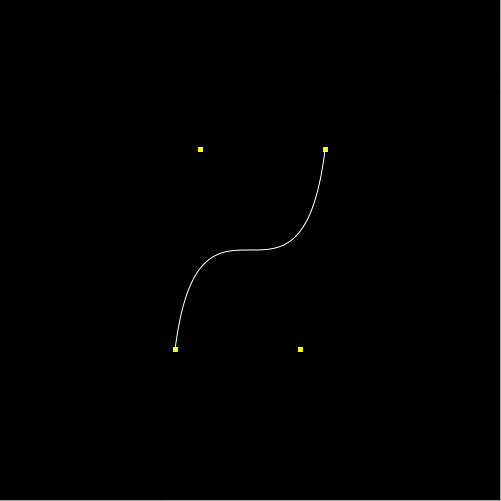
    <br>
    <div style="color:orange; border-bottom: 1px solid #d9d9d9;
    display: inline-block;
    color: #999;
    padding: 2px;">第1.2题抗锯齿结果</div>
</center>

<center>
    
    <br>
    <div style="color:orange; border-bottom: 1px solid #d9d9d9;
    display: inline-block;
    color: #999;
    padding: 2px;">第1.3题原结果</div>
</center>

<center>
    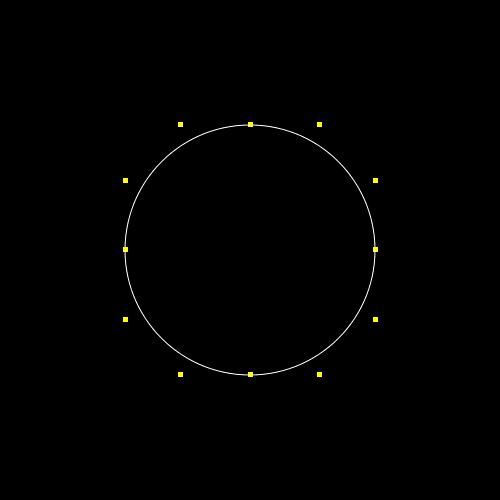
    <br>
    <div style="color:orange; border-bottom: 1px solid #d9d9d9;
    display: inline-block;
    color: #999;
    padding: 2px;">第1.3题抗锯齿结果</div>
</center>

## 2.1
先使用`glMap2f(GL_MAP2_VERTEX_3, 0, 1, 0, 1, self.controlPoints)`绑定一个二维数组，贝塞尔曲面的控制点。原理很简单，就是先在一个维度上利用一个参数求出各行控制点确定的一组点（每行一个），然后利用这一组点当作控制点，，再传入一个参数，计算得到最终的曲面上的点。确定点的过程和上述类似，我们在下一问中仍然使用de Casteljau 算法计算曲线上的点。
## 2.2
```python
    def display(self):
        """Display the control points as dots."""
        glClear(GL_COLOR_BUFFER_BIT | GL_DEPTH_BUFFER_BIT)
        glColor3f(0.0, 1.0, 0.0)
        glRotatef(45.0,45.0, 45.0, 1.0)
        #glEvalMesh2(GL_FILL, 0, 20, 0, 20)

        glBegin(GL_POINTS)
        num_segments = 30  # Number of segments to approximate the curve
        for i in range(num_segments + 1):
            for j in range(num_segments + 1):
                u = i / num_segments
                v = j / num_segments
                curve_point = self.compute_bezier_point(u, v)
                glVertex3fv(curve_point)
        glEnd()
        glFlush()

        # 2.2

        glutSwapBuffers()

```
因为只需要画出点即可，因此我们使用`glBegin(GL_POINTS)`，然后用一个两层循环，遍历了平面，间隔取点，传参进入`compute_bezier_point`函数
```python
    def compute_bezier_point(self, u, v):
        """Compute a point on the Bezier curve at parameter t using De Casteljau's algorithm."""
        n = len(self.controlPoints) - 1
        m = len(self.controlPoints[0]) - 1
        temp_points = [[point for point in row] for row in self.controlPoints]  # Copy control points
        
        for t in range(n + 1):
            for l in range(1, m + 1):
                for j in range(m - l + 1):
                    temp_points[t][j] = (
                        (1 - u) * temp_points[t][j][0] + u * temp_points[t][j + 1][0],
                        (1 - u) * temp_points[t][j][1] + u * temp_points[t][j + 1][1],
                        (1 - u) * temp_points[t][j][2] + u * temp_points[t][j + 1][2]
                    )

        for k in range(1, n + 1):
            for i in range(n - k + 1):
                temp_points[i][j] = (
                        (1 - v) * temp_points[i][0][0] + v * temp_points[i + 1][0][0],
                        (1 - v) * temp_points[i][0][1] + v * temp_points[i + 1][0][1],
                        (1 - v) * temp_points[i][0][2] + v * temp_points[i + 1][0][2]
                    )

        return temp_points[0][0]
```
显然，`temp_points`应该使用更多一个维度的数组（三维），按照2.1问的思路，我们先在一个维度每行都上使用de Casteljau 算法。该维度的多个控制点会变成一个，再在第二个维度重复该过程，最终只剩下一个点，就是计算得到的曲面上的点。该过程十分类似于维数坍缩。在依次`glRotatef(45.0,45.0, 45.0, 1.0)`,之后，得到如下一系列结果：
<center>
    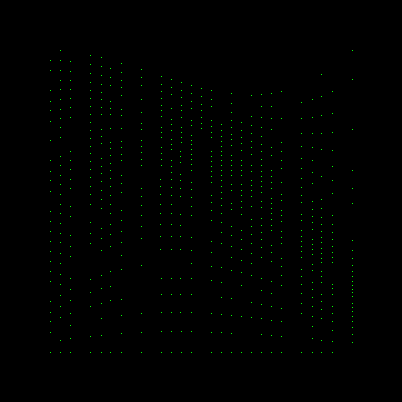
    <br>
    <div style="color:orange; border-bottom: 1px solid #d9d9d9;
    display: inline-block;
    color: #999;
    padding: 2px;">第2.2题结果</div>
</center>
<center>
    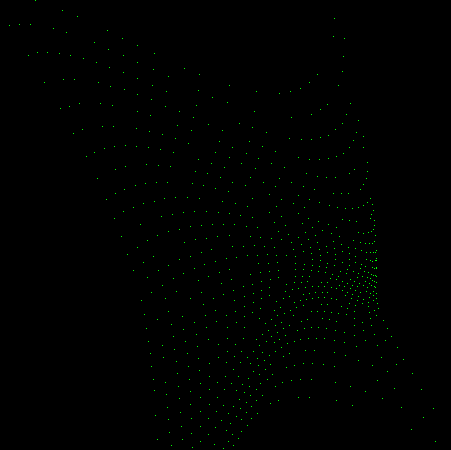
    <br>
    <div style="color:orange; border-bottom: 1px solid #d9d9d9;
    display: inline-block;
    color: #999;
    padding: 2px;">第2.2题结果</div>
</center>
<center>
    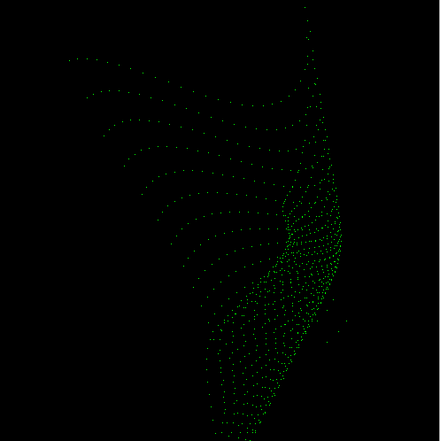
    <br>
    <div style="color:orange; border-bottom: 1px solid #d9d9d9;
    display: inline-block;
    color: #999;
    padding: 2px;">第2.2题结果</div>
</center>
<center>
    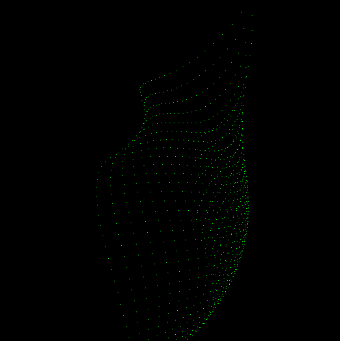
    <br>
    <div style="color:orange; border-bottom: 1px solid #d9d9d9;
    display: inline-block;
    color: #999;
    padding: 2px;">第2.2题结果</div>
</center>
<center>
    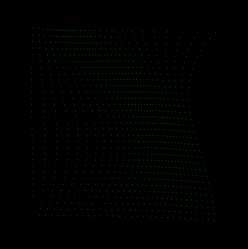
    <br>
    <div style="color:orange; border-bottom: 1px solid #d9d9d9;
    display: inline-block;
    color: #999;
    padding: 2px;">第2.2题结果</div>
</center>
<center>
    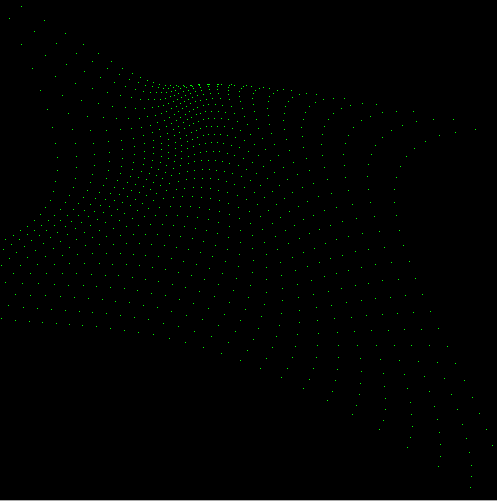
    <br>
    <div style="color:orange; border-bottom: 1px solid #d9d9d9;
    display: inline-block;
    color: #999;
    padding: 2px;">第2.2题结果</div>
</center>
<center>
    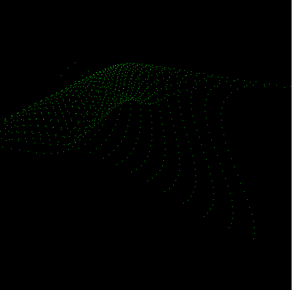
    <br>
    <div style="color:orange; border-bottom: 1px solid #d9d9d9;
    display: inline-block;
    color: #999;
    padding: 2px;">第2.2题结果</div>
</center>
<center>
    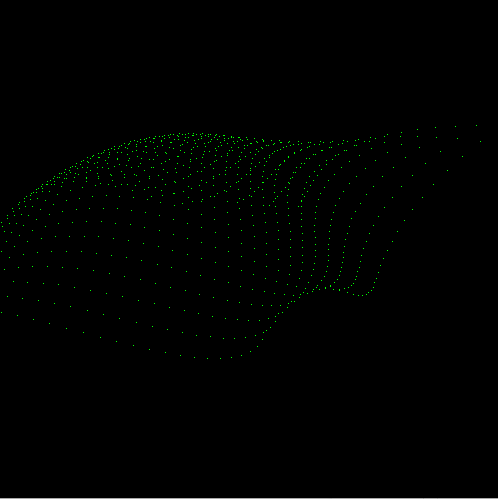
    <br>
    <div style="color:orange; border-bottom: 1px solid #d9d9d9;
    display: inline-block;
    color: #999;
    padding: 2px;">第2.2题结果</div>
</center>
