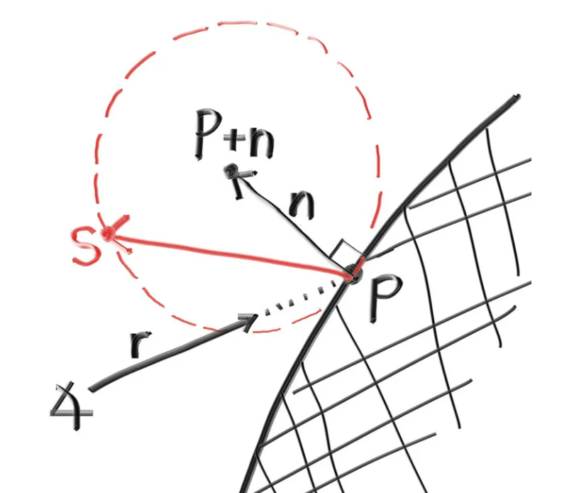
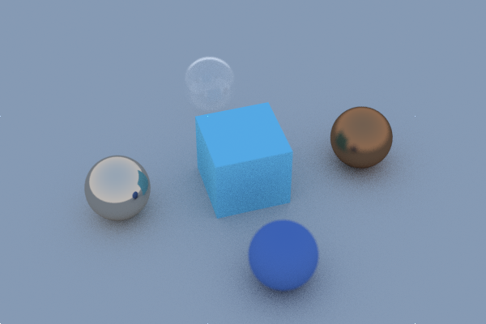
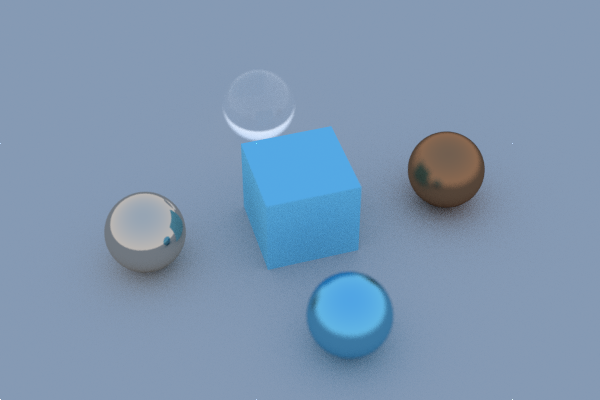
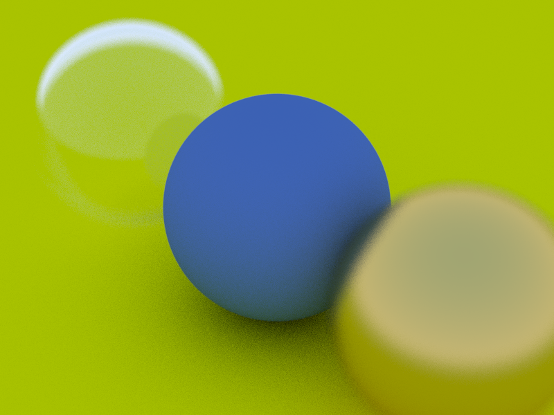
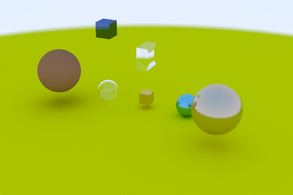
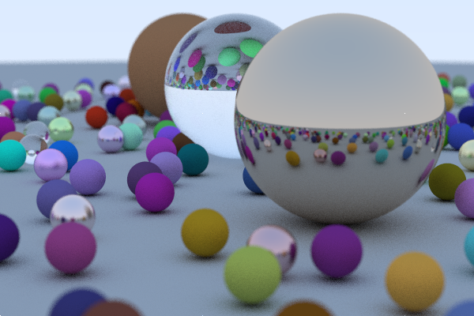
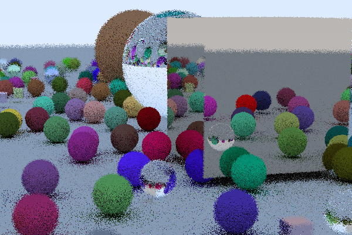
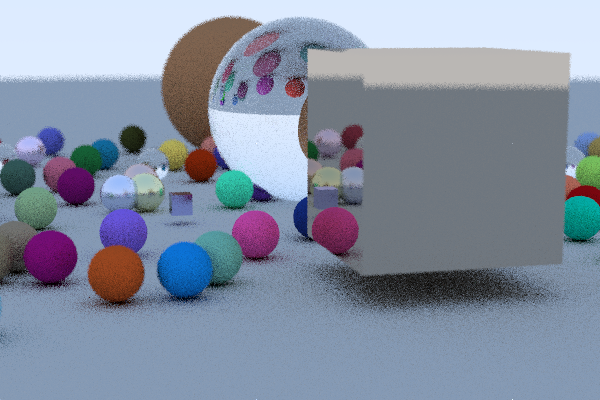

# 计算机图形学大作业
*****
## 光线追踪原理分析
### Whitted Style
1980 年，Turner Whitted 在一篇题为“An Improved Illumination Model for Shaded Display”的 Siggraph 论文中首次详细介绍了该技术。由于这个原因，该算法通常被命名为Whitted（风格）光线追踪。这也是光线追踪的起源。
主要想法很简单，由于光路可逆，与光栅化相反，我们也可以从照相机出发，沿着看每个像素的方向，倒着寻找光走过的路径，控制反射和折射现象的光学（和物理）定律是众所周知的。反射方向仅取决于表面方向和入射光方向。折射方向可以使用斯涅尔定律计算，并且取决于表面方向（表面法线）、入射光方向和材料折射率（水的折射率约为 1.3，玻璃的折射率约为 1.5）。如果知道这些参数，计算这些方向只是反射和折射定律的直接应用，其方程非常简单。
同样，如果交点处的表面是不透明且漫反射的，我们需要做的就是使用照明模型（例如Phong模型）来计算交点处物体的颜色。此过程还涉及向场景中每个光源的方向投射光线，以确定该点是否处于阴影中。这些光线称为阴影光线。
可以看到，原来光栅化不好解决的问题仿佛都迎刃而解。但问题同样随之而来，phong模型只是一个经验模型，透明物体既发生反射也发生折射，，那么其中多大部分反射又有多大部分折射呢？在whitted style ray tracing中都没有进行一个很好的界定，只凭借经验显然能够简化我们的工作量，但同样会带来失真的问题。

### 路径追踪
利用路径追踪我们可以实现比Whitted-style ray tracing更好的全局光照（Global Illumination）效果。它的理论基础则是渲染方程，最开始由吉姆·卡基亚（Jim Kajiya）提出。渲染方程是在物理的基础上定义的，利用它我们可以实现基于物理的渲染（PBR，Physically Based Rendering），效果会比以往的Blinn-Phong等模型看上去更加真实。可以说在图形学中，要实现真实的渲染效果就是求解这个方程。
$$
L_o\left(p, \omega_o\right)=L_e\left(p, \omega_o\right)+\int_{\Omega} f_r\left(p, \omega_i, \omega_o\right) L_i\left(p, \omega_i\right) n \cdot \omega_i d \omega_i
$$
简单来理解，$L_o\left(p, \omega_o\right)$ 和$L_e\left(p, \omega_o\right)$都是辐射率，辐射率的指的就是单位面积下接收到的来自单位立体角的辐射通量，常用 L 来表示，其单位为：W/sr·m²。$f_r\left(p, \omega_i, \omega_o\right) $s是双向反射分布函数（BRDF，Bidirectional Reflectance Distribution Function）BRDF决定了物体的材质。比如如果是镜面反射，那么只有在$\omega_i \cdot n=\omega_o \cdot n$ （与法线夹角相等）时，入射光会被反射到Camera上;当 $\omega_i \cdot n$和$\omega_o \cdot n$ 比较接近时才有大于0的返回值，就可以模拟出glossy的材质；不管  $\omega_i \cdot n$和$\omega_o \cdot n$的值为多少都有相同的返回值，那么就是漫反射的材质。BRDF我们常用 $f_r\left(p, \omega_i, \omega_o\right) $来表示，同时我要对P点接收到的所有光都要计算往Camera方向的分布值，然后把它们积分起来，公式如下：
$$
L_o\left(p, \omega_o\right)=\int_{\Omega} f_r\left(p, \omega_i, \omega_o\right) L_i\left(p, \omega_i\right) n \cdot \omega_i d \omega_i
$$
这个方程式被称为反射方程。此时它只比渲染方程少了$L_e\left(p, \omega_o\right)$ 项，这一项的意义是：如果P点自己会发光（Emission），那么自然还要加上自发光往Camera方向的辐射通量。那么反射方程再加上自发光就是Kajiya提出的渲染方程了。

根据渲染方程，我们实际知道了光与物体相撞时怎么走，取代了经验公式，那么怎么求解这个积分就成为了关键。公式很复杂，使用解析法变得不可能，于是我们考虑使用蒙特卡洛积分，用多次碰撞试验的平均来近似碰撞的结果。也即：
$$
\int_a^b f(x) d x=\frac{1}{n} \sum_{i=1}^n \frac{f\left(x_i\right)}{p\left(x_i\right)}
$$
因为P点能够接收到半球内来自四面八方的光，那么我们就可以在半球上的各个方向进行随机的采样。若我们做均匀的采样，由于半球对应的立体角是 2π，因此对应的PDF即为：p(x)=1/2π。由于这样效率较差，我们也可以做重要性采样。

至此还要解决两个问题，首先由于是递归的，那么当随机打出的光线数量很多时，递归几次后光线的数量就会爆炸。例如P点随机100根光线，打到了物体表面上20个点，这些点又要各自产生100根光线，即有20000根光线，而且还会递归下去变得更多，这个运算量明显不符合我们的预期。因此我们每次只随机打一根光线这样的话，虽然计算量不会爆炸，但是误差必然会大的离谱，怎么解决呢？之前是摄像机往某个像素打1根光线，打到的点上产生n根随机方向上的光线。现在被打到的点只能随机产生1根光线了，但是我们可以用n根光线打向像素啊。此外由于像素本身具有大小，我们还往像素中随机采样到的不同位置发射光线，最后把所有光线得到的结果求平均即可，这又是一个蒙特卡洛积分。

第二个问题，即我们的递归函数可能造成无限递归的问题。最简单的方法即是加一个次数的限制，但是这样弹射到限定次数后的能量被浪费掉了，不符合能量守恒。并且弹射的次数少的话，就可能造成场景偏暗，达不到预期的效果，因为真实的环境下光线就是可以无限次弹射的。那么应该怎么处理呢？针对这个问题，人们引入了俄罗斯轮盘赌（Russian Roulette）的方法。我们用俄罗斯轮盘赌的概念来以一定概率来结束我们的递归，并且还能够保证我们得到的结果依旧是我们期望的结果。在shade方法里，我们要求的是 Lo，如果我们递归次数少必然会导致得到的值小于Lo。解决方法是，我们每次以 P 的概率发射光线，P的值在(0,1)之间，其值为多少可以我们自己设置，比如取随机值。那么我们就会有P的概率发射光线，获得到的值我们把它除以P，即 Lo/P，会有1-P的概率不发射光线，获得到的值，即为0。
$$
E=Lo/P*P+0*(1-P)=Lo
$$

*****
## 具体实现
光线追踪的实现非常复杂，想依靠光栅化的一点浅薄的OpenGL的代码积累完成对于我来说的是不现实的。于是我查阅资料，具体实现参考了Peter Shirley的书《Ray Tracing in One Weekend》，作为一个简化版的光线追踪（具体哪里进行了简化后面再说）我用python实现了他在书中展示的效果。并且得到了一些有意思的结果，我们根据代码来看我的复现过程。
### 实现光线类
```python

# ray
class Ray:
    def __init__(self, a, b):
        self.A = a
        self.B = b
    @property 
    def origin(self): 
        return self.A
    @origin.setter
    def origin(self, o): 
        self.A = o
    @property 
    def direction(self): 
        return self.B
    @direction.setter
    def direction(self, d): 
        self.B = d
    def point_at_parameter(self, t):
        return self.A + self.B * t

```
通过起点和方向就可以定义一条射线，表示出我们所需的采样光线。让我们将光线看作一个函数 $\mathbf{P}(t) = \mathbf{A} + t \mathbf{b}$。这里，$\mathbf{P}$是在三维空间中沿着一条线的三维位置。 $\mathbf{A}$是光线的起点，$\mathbf{b}$是光线的方向。光线参数$t$是一个实数。 通过插入不同的$t$值，$\mathbf{P}(t)$沿着光线移动。添加负的$t$值，可以在三维线上的任意位置。对于正的$t$值， 你只能得到$\mathbf{A}$前面的部分，这通常被称为半线或光线。我们一般取正的部分，如果出现负数就要特殊考虑（比如后续实现的立方体碰撞检测）。
### 可命中类
```python
# 碰撞信息检测
class HitRecord:
    def __init__(self, t, p, normal, material):
        self.t = t
        self.p = p
        self.normal = normal
        self.material = material

# 可命中类
class Hitable:
    def __init__(self):
        pass

# 可命中物体列表
class HitableList(Hitable):
    def __init__(self):
        super().__init__()
        self.__list = []
    def __iadd__(self, hitobj):
        if type(hitobj)==list:
            self.__list.extend(hitobj)
        else:
            self.__list.append(hitobj)
        return self
    def append(self, hitobj):
        if type(hitobj)==list:
            self.__list.extend(hitobj)
        else:
            self.__list.append(hitobj)
    def hit(self, r, tmin, tmax):
        hit_anything, closest_so_far = None, tmax
        for hitobj in self.__list:
            rec = hitobj.hit(r, tmin, closest_so_far)
            if rec:
                hit_anything, closest_so_far = rec, rec.t
        return hit_anything
```
按照Peter Shirley的建议我们搭建这三个类，Hitable是一个抽象的可命中类，具体碰撞返回的结果并未给出，这将由后面不同的几何形状与材质给出。光会与多个物体间产生碰撞，怎么决定何时拐弯？这有Hitablelist给出，存储场景中各个物体的信息，依次计算光线是否会与其发生碰撞，选择$t$最小的即为最先发生碰撞的点。上面只完成了场景中多个物体的一次光碰撞的计算，接着可以依次递归（或循环），把反射光当作入射光，只需把多次反射的信息存在HitRecord中即可。这样，我们整个碰撞的框架就建立起来了，只需要往里填具体的碰撞反射折射逻辑即可。

此外，这里相对于完整的path tracing做了一定简化，按理说反射光这里应该按照RR方法概率的选取是否有反射光以避免无限次递归，但概率停止有可能会非常耗时，同时需要更多的path来积出想要的结果。我运行代码限制最大弹射次数（会有能量损失）的简单方法都要花费好几小时，为了渲染效率，舍弃了概率停止的办法，这是第一处简化。

### 材质类
现在我们已经有了光线和整个大致的碰撞逻辑，在碰撞后光如何前进是接下来要研究的问题。我们知道BRDF决定了物体的材质。反之，不同材质也对应不同的BRDF。我们可以制作一些逼真的材质了。一个问题是我们是否混合和匹配几何体和材质（这样我们可以将一个材质分配给多个球体，反之亦然）， 还是几何体和材质紧密绑定（这对于几何体和材质链接的程序对象可能很有用）。我们将选择分开-这在大多数渲染器中是常见的-但请注意还有其他方法。
* **漫反射（Lambertian反射）**
不发出自己的光的漫反射物体仅仅会采用其周围环境的颜色，但它们会用自己固有的颜色调制它。 光线也可能被吸收而不是反射。表面越暗，光线被吸收的可能性越大。任何随机化方向的算法都会产生看起来哑光的表面。让我们从最直观的开始：一个表面在所有方向上都随机反射光线。对于这种材质，击中表面的光线有同等的概率从表面上任何方向反射出去。将反射光线均匀散射到半球上，就可以得到一个漂亮的柔和漫反射模型。
对真实漫反射物体的更准确 的表示是Lambertian分布。该分布以与表面法线之间的角度$\delta$ 成比例地散射反射光线，其中$\delta$ 是反射光线与表面法线之间的角度。这意味着反射光线最有可能在接近表面法线的方向上散射，而在远离法线的方向上散射的可能性较小。与我们之前的均匀散射相比，这种非均匀的Lambertian分布更好地模拟了真实世界中材料的反射。
我们可以通过将一个随机单位向量添加到法线向量上来创建这个分布。在表面上的交点处，有一个命中点$P$和表面法线$n$。在交点处，该表面有两个唯一的接触点，所以对于任何交点，只能有两个与之相切的单位球（每个 表面的一个唯一的球）。这两个单位球将通过其半径的长度从表面上移开，对于单位球来说，半径恰好为1。
一个球将沿着表面法线的方向（$n$ ）移开，另一个球将沿着相反的方向（$-n$）移开。这样，我们得 到了两个单位尺寸的球，它们只在交点处“刚好”接触表面。其中一个球的中心位于$P+n$，另一个球的中心位于$P-n$ 。中心位于$P-n$的球被认为是在表面“内部”，而中心位于$P+n$的球被认为是在表面“外部”。
我们想要选择与光线起点在表面同一侧的切线单位球。在这个单位半径球上选择一个随机点$S$，并从命中点$P$ 向随机点$S$ 发送一条光线（这是向量$S-P$）：
<center>
    
    <br>
    <div style="color:orange; border-bottom: 1px solid #d9d9d9;
    display: inline-block;
    color: #999;
    padding: 2px;">Lambertian反射示意图</div>
</center>

```python
# lambertian material
class Lambertian(Material):
    def __init__(self, albedo):
        super().__init__()
        self.__albedo = albedo
    def scatter(self, r_in, rec):
        target = rec.p + rec.normal + random_in_unit_sphere()
        return Ray(rec.p, target-rec.p), self.__albedo
```
代码实现逻辑很简单。对于我们已经具有的Lambertian（漫反射）情况，它可以始终散射并经过其反射率$R$进行衰减，或者它可以有时散射 （以概率$1-R$）而没有衰减（其中没有散射的光线仅被材质吸收）。它也可以是这两种策略的混合物。我们选择始终散射。得到我们的一个简化实现。值得一提的是`random_in_unit_sphere()`的实现方式。
```python
def random_in_unit_sphere(): 
    while True: 
        # random vector x, y, z in [-1, 1]
        p = 2*vec3(rand01(), rand01(), rand01()) - vec3(1, 1, 1)  
        if p.magnitude_squared() < 1:
            break
    return p

```
相当于随机在一个正方体内部取值，然后判断是不是在球内，不是就舍去，直到找到一个满足要求的即可。
<center>
    
    <br>
    <div style="color:orange; border-bottom: 1px solid #d9d9d9;
    display: inline-block;
    color: #999;
    padding: 2px;">不同材质物体渲染展示</div>
</center>

中间的方块和下方的小球我采用了Lambertian漫反射材质，可以看到也有明暗的变化，同时下方产生了柔和的阴影。

* **金属材质**
对于抛光金属，光线不会随机散射。关键问题是：光线如何从金属镜面反射？这里我们可以用向量数学来解答：入射光线的方向是$v$ 反射光线方向就是$v+2b$。在我们的设计中，$n$ 是一个单位向量，但$v$ 可能不是。 $b$的长度应该是$v \cdot n$。因为$v$指向内部，我们需要一个负号，得到：
```python
def reflect(v, n):
    return v - 2*v.dot(n)*n

# metal material
class Metal(Material):
    def __init__(self, albedo, fuzz=0):
        super().__init__()
        self.__albedo = albedo
        self.__fuzz = min(fuzz, 1)
    def scatter(self, r_in, rec):
        # reflection
        reflected = r_in.direction.normalize().reflect(rec.normal)
        # fuzzy
        scattered = Ray(rec.p, reflected + self.__fuzz*random_in_unit_sphere())
        attenuation = self.__albedo
        return (scattered, attenuation) if scattered.direction.dot(rec.normal) > 0 else None

```
在反射方向上加上一定的模糊度（通过 `self.__fuzz*random_in_unit_sphere() `实现）添加模糊度可以模拟不同金属的质感，如果是0，则只会发生镜面反射，如镜子一般。
<center>
    
    <br>
    <div style="color:orange; border-bottom: 1px solid #d9d9d9;
    display: inline-block;
    color: #999;
    padding: 2px;">不同材质物体渲染展示</div>
</center>

这里左中下三个小球都选取了金属材质，同时fuzz采用0，0，2，0.3，可以明显看到左边小球类似镜面的反射效果，完美的看到了周围的物体，另两个小球更接近于磨砂质感，成像不那么清晰。

* **玻璃材质**
像水、玻璃和钻石这样的透明材料是电介质。当光线击中它们时，它会分裂成一个反射光线和一个折射（传输）光线。我们将 通过随机选择反射和折射来处理这个问题，每次交互只生成一个散射光线。（简化计算，否则玻璃球多了，计算开销成指数级增长）
折射是由斯涅尔定律描述的：
$$
\eta \cdot \sin \theta=\eta^{\prime} \cdot \sin \theta^{\prime}
$$
其中，$\theta$和$\theta'$ 是从法线的角度，$\eta$和$\eta'$ 是折射指数 （通常空气 = 1.0，玻璃 = 1.3–1.7，钻石 = 2.4）。我们可以根据入射方向算出折射方向。
一个棘手的实际问题是，当光线在折射指数较高的材料中时，斯涅尔定律没有实数解，因此不可能有折射。 当然，这也是可以用繁琐的数学推导出来的。现在，真正的玻璃的反射率随角度变化 -- 以陡峭的角度看窗户，它变成了一面镜子。有一个大而丑陋的等式，但几乎所有人都使用 Christophe Schlick 的一个便宜且惊人地准确的多项式近似。
```python
def refract(v, n, ni_over_nt):
    # Snell's law: n*sin(theta) = n'*sin(theta')
    uv = v.normalize()
    dt = uv.dot(n)
    discriminant = 1 - ni_over_nt*ni_over_nt*(1-dt*dt)
    if discriminant > 0:
        return ni_over_nt*(uv-n*dt) - n*np.sqrt(discriminant)
    return None

# dielectric material
class Dielectric(Material):
    def __init__(self, ri):
        super().__init__()
        self.__ref_idx = ri
    def scatter(self, r_in, rec):
        reflected = r_in.direction.reflect(rec.normal)
        if r_in.direction.dot(rec.normal) > 0:
            outward_normal = -rec.normal
            ni_over_nt = self.__ref_idx
            cosine = self.__ref_idx * r_in.direction.dot(rec.normal) / r_in.direction.magnitude()
        else:
            outward_normal = rec.normal
            ni_over_nt = 1/self.__ref_idx
            cosine = -r_in.direction.dot(rec.normal) / r_in.direction.magnitude()
        refracted = refract(r_in.direction, outward_normal, ni_over_nt)
        reflect_probe = schlick(cosine, self.__ref_idx) if refracted else 1
        if rand01() < reflect_probe:
            scattered = Ray(rec.p, reflected)
        else:
            scattered = Ray(rec.p, refracted)
        return scattered, vec3(1, 1, 1)
```
首先我们可以计算出反射和折射的方向，接着使用 schlick 函数计算反射概率 reflect_probe。schlick 函数模拟了在边缘入射时反射的增强效应。如果折射光线存在（即非全反射），则计算反射概率，否则设为1。根据反射概率随机决定是进行反射还是折射。如果生成的随机数小于反射概率，则使用反射方向，否则使用折射方向。最后返回散射后的光线和衰减系数，这里用 vec3(1, 1, 1) 表示不发生衰减（全透明）。
<center>
    
    <br>
    <div style="color:orange; border-bottom: 1px solid #d9d9d9;
    display: inline-block;
    color: #999;
    padding: 2px;">不同材质物体渲染展示</div>
</center>

这里我放置了一个实心玻璃球，可以看到上方的天空，这是符合我们的直觉的，如果仔细观察的话，也可以在玻璃球上看到其他物体的轮廓，和生活中经验非常类似，透光的基础上会有微弱的反射。

一个有趣且简单的电介质球技巧是注意到，如果你使用一个负半径，几何形状不受影响，但是表面法线向内指。由于负半径的球体是一个 气泡，其内部是球体外的无限空间。其外部是球体内的有限气泡，所以外向法线需要指向球体中心。除以（负的）半径会翻转我们想要的法线。我们可以使用这个空心球体的技巧来建模一个具有给定厚度的球体（比如透明空心玻璃球，效果意外的好）。
<center>
    
    <br>
    <div style="color:orange; border-bottom: 1px solid #d9d9d9;
    display: inline-block;
    color: #999;
    padding: 2px;">不同材质物体渲染展示</div>
</center>

在渲染这副图的时候，我使用负半径嵌套，
```python
        Sphere(vec3(-2, 0, -1), 0.5,     Dielectric(1.5)),
        Sphere(vec3(-2, 0, -1), -0.45,   Dielectric(1.5)),
```
模拟了一个有一定厚度的薄壁空心玻璃球，效果拟合得很好，大部分是透光的，有轻微的折射和反射，符合直觉。可以与实心玻璃球的图进行对比查看效果：
<center>
    
    <br>
    <div style="color:orange; border-bottom: 1px solid #d9d9d9;
    display: inline-block;
    color: #999;
    padding: 2px;">不同材质物体渲染展示</div>
</center>

### 物体类
由于我们把材质和物体没有绑在一起，我们就可以把不同的材质赋给不同的物体。创建一个几何形体最重要的目的是算出与光线的交点以及法线，具体光线碰撞后怎么走是由材质决定的。问题变得简单了。
* **球**
```python
# sphere hitable object
class Sphere(Hitable):
    def __init__(self, center, radius, material):
        super().__init__()
        self.__center = center
        self.__radius = radius
        self.__material = material

    def hit(self, r, tmin, tmax):
        oc = r.origin - self.__center
        a = r.direction.dot(r.direction)
        b = 2 * oc.dot(r.direction)
        c = oc.dot(oc) - self.__radius*self.__radius
        discriminant = b*b - 4*a*c
        if discriminant > 0:
            temp = (-b - np.sqrt(discriminant)) / (2*a)
            if tmin < temp < tmax:
                p = r.point_at_parameter(temp) 
                return HitRecord(temp, p, (p - self.__center) / self.__radius, self.__material )
            temp = (-b + np.sqrt(discriminant)) / (2*a)
            if tmin < temp < tmax:
                p = r.point_at_parameter(temp) 
                return HitRecord(temp, p, (p - self.__center) / self.__radius, self.__material )
        
        return None

```
由于光线可写作$\mathbf{P}(t) = \mathbf{A} + t \mathbf{b}$，计算与球心的距离，就可以知道与球是否相交。含$t$带入
$$
(\mathbf{A}+\mathbf{b}t-\mathbf{C}) \cdot (\mathbf{A}+\mathbf{b}t-\mathbf{C})=R^2
$$
化简得：
$$
(\mathbf{b} \cdot \mathbf{b})t^2+2(\mathbf{b} \cdot (\mathbf{A}-\mathbf{C}))t+(\mathbf{A}-\mathbf{C}) \cdot (\mathbf{A}-\mathbf{C})-R^2=0
$$
然后只需要计算判别式讨论解$t$的情况，存入`HitRecord`即可。
* **长方体**
长方体就相对来说复杂一些，实现方法和包围盒AABB是一样的。思路是分别计算光线与六个面的交点，解出对应时间。从两两对应面的tmin中找最大的，从tmax中找最小的，也就是取交集，判断会不会和盒子相撞。
```python
class Cuboid(Hitable):
    def __init__(self, center, material, width, height, length):
        super().__init__()
        self.center = center
        self.width = width
        self.height = height
        self.length = length
        self.material = material
        # lb 左下角，rt右上角
        self.lb = self.center - vec3(width/2, height/2, length/2)
        self.rt = self.center + vec3(width/2, height/2, length/2)
        self.lb_local_basis = self.lb
        self.rt_local_basis = self.rt

        # 基向量
        self.ax_w = vec3(1.,0.,0.)
        self.ax_h = vec3(0.,1.,0.)
        self.ax_l = vec3(0.,0.,1.)

        self.inverse_basis_matrix = np.array([[self.ax_w[0],       self.ax_h[0],         self.ax_l[0]],
                                              [self.ax_w[1],       self.ax_h[1],         self.ax_l[1]],
                                              [self.ax_w[2],       self.ax_h[2],         self.ax_l[2]]])

        self.basis_matrix = self.inverse_basis_matrix.T
    def hit(self, r, tmin, tmax):
        UPWARDS = 1
        UPDOWN = -1         
        FARAWAY = 1.0e39
        
        O_local_basis = np.dot(r.origin, self.basis_matrix)
        D_local_basis = np.dot(r.direction, self.basis_matrix)

        dirfrac = 1.0 / D_local_basis
  

        t1 = (self.lb_local_basis[0] - O_local_basis[0])*dirfrac[0]
        t2 = (self.rt_local_basis[0] - O_local_basis[0])*dirfrac[0]
        t3 = (self.lb_local_basis[1] - O_local_basis[1])*dirfrac[1]
        t4 = (self.rt_local_basis[1] - O_local_basis[1])*dirfrac[1]
        t5 = (self.lb_local_basis[2] - O_local_basis[2])*dirfrac[2]
        t6 = (self.rt_local_basis[2] - O_local_basis[2])*dirfrac[2]

        t_min = np.maximum(np.maximum(np.minimum(t1, t2), np.minimum(t3, t4)), np.minimum(t5, t6))
        t_max = np.minimum(np.minimum(np.maximum(t1, t2), np.maximum(t3, t4)), np.maximum(t5, t6))

        # if t_max < 0, 负时间相交
        # if t_min > t_max, 不相交
        mask1 = (t_max < 0) | (t_min > t_max)
        # if t_min < 0 在盒子里，tmax首次相交
        mask2 = t_min < 0
        hit_info = np.select([mask1,mask2,True] , [FARAWAY , [t_max] ,  [t_min]])

        if hit_info is not None and tmin < hit_info[0] < tmax:
            return HitRecord(hit_info[0], r.point_at_parameter(hit_info[0]) , self.get_Normal(r.point_at_parameter(hit_info[0])), self.material)
        else:
            return None

   
    def get_Normal(self, point):
        P = np.dot(point - self.center, self.basis_matrix)
        absP = np.abs(P)
        Pmax = np.max([absP[0], absP[1], absP[2]])
        P[0] = np.where(Pmax == absP[0], np.sign(P[0]),  0.)
        P[1] = np.where(Pmax == absP[1], np.sign(P[1]),  0.)
        P[2] = np.where(Pmax == absP[2], np.sign(P[2]),  0.)

        return np.dot(P, self.inverse_basis_matrix)

```
如上所述，分为几种情况，首先排除负距离相交（光线是射线）和无交集的情况。其次如果最小时间是负的最大时间是正的，说明出发点就在盒子里，其他的就是正常相交了。根据情况分别取$t$，就可以找到交点，再找交点所在的面，就可以找到法线方向。
### 照相机类
```python
# camera
class Camera:
    def __init__(self, lookfrom, lookat, vup, vfov, aspect, aperture, focus_dist):
        self.__lens_radius = aperture/2
        self.__focus_dist = focus_dist
        self.__origin = lookfrom
        self.__direction = lookat -lookfrom
        self.__vup = vup
        self.__vfov = vfov * np.pi / 180
        self.__aspect = aspect
        self.update()
    @property
    def aspect(self):
        return self.__aspect
    @aspect.setter
    def aspect(self, aspect):
        self.__aspect = aspect
        self.update()
    @property
    def vfov_degree(self):
        return self.__vfov * 180/np.pi
    @vfov_degree.setter
    def vfov_degree(self, vfov):
        self.__vfov = vfov * np.pi/180
        self.update()
    def update(self):
        half_height = np.tan(self.__vfov/2)
        half_width = self.__aspect * half_height
        self.__w = -self.__direction.normalize()
        self.__u = self.__vup.cross(self.__w).normalize()
        self.__v = self.__w.cross(self.__u)
        self.__lower_left_corner = self.__origin - half_width*self.__focus_dist*self.__u - half_height*self.__focus_dist*self.__v - self.__focus_dist*self.__w
        self.__horizontal = 2*half_width*self.__focus_dist*self.__u
        self.__vertical = 2*half_height*self.__focus_dist*self.__v
    def get_ray(self, s, t):
        rd = self.__lens_radius*random_in_unit_disk()
        offset = self.__u*rd.x + self.__v*rd.y # dot(rd.xy, (u, v))
        return Ray(
            self.__origin + offset,
            self.__lower_left_corner + s*self.__horizontal + t*self.__vertical - self.__origin - offset)

def random_in_unit_disk(): 
    while True: 
        # random vector x, y, z in [-1, 1]
        p = 2*vec3(rand01(), rand01(), 0) - vec3(1, 1, 0)  
        if p.magnitude_squared() < 1: # magnitude of vector has to be less than 1 
            break
    return p
```
设计了一个相机，用于生成光线以渲染场景。构造函数接受相机的位置 `lookfrom`、观察点位置 `lookat`、上方向 `vup`、垂直视场 `vfov`（以度为单位）、视口宽高比 `aspect`、光圈大小 `aperture `和焦点距离 `focus_dist`。

`get_ray`函数：生成从相机发射的光线。接受参数 s 和 t，它们表示在屏幕上的位置（通常在 [0, 1] 范围内）。生成的光线是从相机原点 `__origin`发射，经过屏幕上 (s, t) 位置的点。

`rd` 是一个表示光圈偏移的随机向量，由`random_in_unit_disk` 函数生成。`offset` 表示将光圈偏移应用到相机原点的偏移量。返回的光线方向是从` __origin + offset` 到 (s, t) 点的方向。

这里的照相机参考了Peter Shirley的实现方法，对于相机进行了更细致的模拟，包括透镜大小、光圈、焦距等，可以实现广角、失焦模糊等有趣的效果，对于他下一本书有着更为紧密的联系。简化版的光追可以忽略这些，仅从一个点发出光线就可以了。

当然，按照老爷子给出的改变光圈的办法，可以得到很棒的效果。
<center>
    
    <br>
    <div style="color:orange; border-bottom: 1px solid #d9d9d9;
    display: inline-block;
    color: #999;
    padding: 2px;">失焦模糊</div>
</center>

### scene类
有了可碰撞的物体，有了照相机，我们已经可以创建场景了，可以像我一样随意布置场景，渲染看看效果，也可以按照老爷子完成图那样随机生成小球，再摆几个大球，观察结果。当然，有了方块的实现之后，就更有趣了。放入摄像机，大功告成。只需要进一步传入主渲染管线即可。
```python
class Scene:
    def __init__(self, size):
        self.size = size 
    
    def random_scene(self):
        objects = HitableList()
        objects.append(Sphere(vec3(0, -1000, 0), 1000, Lambertian(vec3(0.5, 0.5, 0.5))))

        for a in range(-11, 11):
            for b in range(-11, 11):
                choose_mat = rand01()
                center = vec3(a+0.9*rand01(), 0.2, b+0.9*rand01())
                if (center-vec3(4, 0.2, 0)).magnitude() > 0.9:
                    if choose_mat < 0.4:
                        # diffuse
                        mat = Lambertian(vec3(rand01()*rand01(), rand01()*rand01(), rand01()*rand01()))
                        objects.append(Cuboid(center, mat, 0.2, 0.2, 0.2))  
                    if choose_mat < 0.8:
                        # diffuse
                        mat = Lambertian(vec3(rand01()*rand01(), rand01()*rand01(), rand01()*rand01()))
                        objects.append(Sphere(center, 0.2, mat)) 
                    elif choose_mat < 0.87:
                        # metal
                        mat = Metal(vec3(0.5*(1+rand01()), 0.5*(1+rand01()), 0.5*(1+rand01())), 0.5*rand01())
                        objects.append(Sphere(center, 0.2, mat))
                    elif choose_mat < 0.95:
                        # metal
                        mat = Metal(vec3(0.5*(1+rand01()), 0.5*(1+rand01()), 0.5*(1+rand01())), 0.5*rand01())
                        objects.append(Cuboid(center, mat, 0.2, 0.2, 0.2))
                    else:
                        # glass
                        mat = Dielectric(1.5)
                        objects.append(Sphere(center, 0.2, mat))

        objects.append(Sphere(vec3(0, 1, 0), 1, Dielectric(1.5)))
        objects.append(Sphere(vec3(-4, 1, 0), 1, Lambertian(vec3(0.4, 0.2, 0.1))))
        objects.append(Cuboid(vec3(4, 1, 0), Metal(vec3(0.7, 0.6, 0.5), 0.0), 1.8, 1.8, 1.8))

        lookfrom = vec3(12, 2, 3)
        lookat = vec3(0, 0, 0)
        dist_to_focus = 10
        #dist_to_focus = (lookat-lookfrom).magnitude()
        aperture = 0.1
        cam = Camera(lookfrom, lookat, vec3(0, 1, 0), 20, self.size[0]/self.size[1], aperture, dist_to_focus)
        return objects, cam

    def create_scene(self):
        objects = HitableList()
        objects += [
            #Sphere(vec3(0, 0, -1), 0.5,      Lambertian(vec3(0.1, 0.2, 0.5))),
            Sphere(vec3(0, -100.5, -1), 100, Lambertian(vec3(0.8, 0.8, 0))),
            Sphere(vec3(2, 0, -1), 0.5,      Metal(vec3(0.2, 0.6, 0.8), 0.2)),
            Sphere(vec3(-2, 0, -1), 0.5,     Dielectric(1.5)),
            Sphere(vec3(-2, 0, -1), -0.45,   Dielectric(1.5)),
            Cuboid(vec3(-2, 3, -1), Metal(vec3(0.1, 0.2, 0.5)), 0.7, 0.7, 0.7),
            Cuboid(vec3(0, 0, -1), Metal(vec3(0.8, 0.6, 0.2)), 0.5, 0.5, 0.5),
            Cuboid(vec3(0, 2, -1), Dielectric(1.5), 0.5, 1, 1),
            Sphere(vec3(-4, 1, 0), 1, Lambertian(vec3(0.4, 0.2, 0.1))),
            Sphere(vec3(4, 1, 1), 1, Metal(vec3(0.7, 0.6, 0.5), 0.0))
        ]
        lookfrom = vec3(10, 10, 20)
        lookat = vec3(0, 0, -1)
        dist_to_focus = (lookat-lookfrom).magnitude()
        aperture = 0.5
        cam = Camera(lookfrom, lookat, vec3(0, 1, 0), 20, self.size[0]/self.size[1], aperture, dist_to_focus)
        return objects,cam 
```
<center>
    
    <br>
    <div style="color:orange; border-bottom: 1px solid #d9d9d9;
    display: inline-block;
    color: #999;
    padding: 2px;">自己摆放的场景</div>
</center>

Ps：这个玻璃立方体的样子有些奇怪，感觉是反射与折射的关系没有处理好，可能是schlik近似中随机折射反射导致的。
<center>
    
    <br>
    <div style="color:orange; border-bottom: 1px solid #d9d9d9;
    display: inline-block;
    color: #999;
    padding: 2px;">随机生成的场景</div>
</center>

Ps；这是书中比较有代表性的图片样式，复现效果非常的不错。可以看到明显的软阴影，以及镜面小球多次反射的图像。
但由于这个图片中物体过多，需要的渲染时间非常的长，我在加入长方体之后计算更加的复杂，相比于这个图又变慢了不少，我选取了更少像素的采样数，得到噪点更多的结果，但也恰好反映了蒙特卡洛积分的特点以及ray tracing一个很重要的问题，如何降噪（哪怕在上图这样每个像素100次采样的结果噪点也是无法避免的）。
<center>
    
    <br>
    <div style="color:orange; border-bottom: 1px solid #d9d9d9;
    display: inline-block;
    color: #999;
    padding: 2px;">低采样率下的光追效果</div>
</center>
<center>
    
    <br>
    <div style="color:orange; border-bottom: 1px solid #d9d9d9;
    display: inline-block;
    color: #999;
    padding: 2px;">较低采样率下的采样效果</div>
</center>

### 主渲染管线
我借鉴使用了pygame库，能够创建可视化窗口，包装在Application类里，包含了一系列基础工作，不再赘述。render类里主要实现了路径追踪算法流程。
```python
    def run(self):
        no_samples = self.__no_samples
        count = 0
        colarr = [0] * (self.__size[0] * self.__size[1] * 3)
        
        for x in range(self.__size[0]):
            for y in range(self.__size[1]):
                col = vec3()
                for s in range(no_samples):
                    u, v = (x + rand01()) / self.__size[0], (y + rand01()) / self.__size[1]
                    r = self.__cam.get_ray(u, v)
                    col += Rendering.rToColor(r, self.__world, 0)
                
                arri = y * self.__size[0] * 3 + x * 3
                colarr[arri+0] += col[0] 
                colarr[arri+1] += col[1]
                colarr[arri+2] += col[2] 
                col = vec3(colarr[arri+0], colarr[arri+1], colarr[arri+2])    

                self.__thread_lock.acquire()
                surfaceSetXYWHf(self.__image, x, y, 1, 1, col / no_samples)
                self.__thread_lock.release()
                
                count += 1
                self.__progress = count / (no_samples * self.__size[0] * self.__size[1])
                
                if self._stopped:
                    break

```
可以看到，这里对每个像素进行多次采样，同时，在每个像素内也选取随机位置坐标，进行蒙特卡洛积分，对最后的颜色进行平均。与前面原理提到的是相同的。
```python
    max_dist = 1e20
    @staticmethod
    def rToColor(r, world, depth):
        rec = world.hit(r, 0.001, Rendering.max_dist) 
        if rec:
            if depth >= 50: #并不准确的限制，为了减少渲染时间
                return vec3(0, 0, 0) # TODO !!!
            sc_at = rec.material.scatter(r, rec)
            if not sc_at:
                return vec3(0, 0, 0)
            return multiply_components(sc_at[1], Rendering.rToColor(sc_at[0], world, depth+1)) #递归

        unit_direction = r.direction.normalize()
        t = 0.5 * (unit_direction.y + 1)
        return (1-t)*vec3(1, 1, 1) + t*vec3(0.5, 0.7, 1)#简单模拟天空的颜色
```
比较重要的一个细节是tmin设置为0.001，原因在于当光线与表面相交时，它将尝试准确计算交点。然而，对于我们来说，这个计算容易受 到浮点舍入误差的影响，这可能导致交点略微偏离。这意味着下一条光线的起点，即从表面上随机散射出的光线，不太可能与表面完全平齐。它可能略微在表面上方，也可能略微在表面下方。如果光线的起点刚好在表面下方，那么它可能会再 次与该表面相交。这意味着它将在$t=0.00000001$或其他浮点近似值处找到最近的表面。解决此问题的最简单方法是忽略非常接近计算交点的相交点，也就是tmin很小时不再考虑。

这里相较于完整的路径追踪又进行了简化，没有使用RR的方法进行中止，而是设置了最远距离与最大弹射次数，以免陷入无限递归或者走无限远无结果的情况。但这样做的代价是有能量损失，但我们又知道对弹射次数的限制会减弱场景亮度，我们50次的限制对于整个渲染结果已经非常接近了。因此采用这样的简化。否则渲染时间可能要以天计了。
## 结语
本次大作业，我参考Peter Shirley的书《Ray Tracing in One Weekend》实现了一个简单的不完全版的光线追踪器。同时支持的物体形状和材质都不多。也没有进行优化和加速，但已经可以产生令人惊讶的效果。
还要感谢github上https://github.com/rafael-fuente/Python-Raytracer 完成度非常高的一个ray tracing项目，学到了许多。计算机图形学是一门非常有意思的课，结合了各个学科的知识，难度也不小，总而言之，谢谢老师带我走进CG的殿堂。